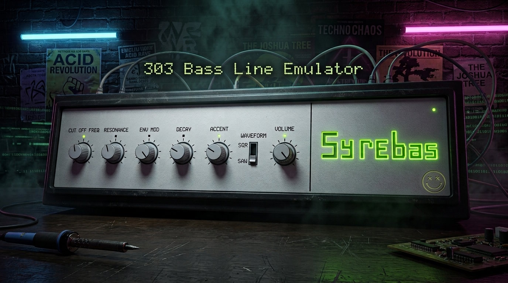

# Acidus



**Acidus** is a lightweight, faithful Roland TB-303 bass synthesizer emulator plugin written in modern C++17 using the [CLAP](https://cleveraudio-plug.info/) (Clever Audio Plug-in) standard.

---

## Key Features

- **Pure C++ DSP Engine**: Faithful 8x oversampled coupled diode ladder filter solver with physical BJT thermal voltage scaling and nonlinear saturation.
- **Custom Native Vector/Pixel GUI**: Lightweight pixel-rendered front panel featuring controls for Cutoff, Resonance, Env Mod, Decay, Accent, Waveform, Tuning, and Master Volume, plus a custom Acid Green logo with multi-layer glow.
- **CLAP Standard Support**: Full support for CLAP parameter automation, state save/restore, and host event flushing.
- **Cross-Platform Support**: Linux (X11), Windows (Win32), and macOS (Cocoa).

---

## Building

### Prerequisites

- CMake (>= 3.15)
- C++17 compliant compiler (`GCC`, `Clang`, or `MSVC`)
- Linux: `libx11-dev`

### Build Steps

```bash
cmake -B build -DCMAKE_BUILD_TYPE=Release
cmake --build build
```

The resulting CLAP plugin (`acidus.clap`) will be located in the `build/` directory.

### Calibration build

By default the plugin only exposes the eight front-panel controls (including
a Tuning trim, ±700 cents to match the real hardware's documented trim
range -- useful for nudging the plugin into tune against a reference
hardware recording that's itself slightly off-pitch) as CLAP parameters,
matching the real hardware's user-facing surface. A separate build
configuration additionally exposes every hidden circuit-topology constant
(ladder coupling-pole corners, VCA saturation drive, etc.) as automatable
CLAP parameters under `Experimental/...` module paths, each spanning the
full plausible range documented in `TB303_PARAMETER_CONFIDENCE.md`, so an
external fitting/optimization tool -- or a human A/B-ing against a reference
hardware recording -- can push every free constant in the model to its
documented extremes:

```bash
cmake -B build-calibration -DCMAKE_BUILD_TYPE=Release -DACIDUS_CALIBRATION_BUILD=ON
cmake --build build-calibration
```

Nothing in the DSP core depends on which configuration is used -- the
calibration build is the exact same signal path, just with more of its
constants exposed as host-automatable parameters instead of compiled-in
defaults. See `TB303_PARAMETER_CONFIDENCE.md` for what each one backs.

### Calibrating against hardware reference samples

`tools/calibrate_reference.py` fits the model to the hardware TB-303 notes in
`test/resources` (file-name format: `test/resources/reference_resources.md`).
It renders each note through the real `SynthEngine` (via the
`acidus_calibration_render` shared library, built automatically), and runs a
time-capped CMA-ES search over every model constant in `SynthParameters`,
the hardware knob positions and the note timing. It compares full-note
harmonic levels, inter-harmonic content, RMS envelopes and 1/3-octave
spectrograms.

```bash
pip install numpy matplotlib        # matplotlib optional (plots)
python3 tools/calibrate_reference.py                     # 20 min cap, 4 min patience
python3 tools/calibrate_reference.py --evaluate-only     # score the current code
python3 tools/calibrate_reference.py --exclude c5r1 --apply   # drop a suspect sample, write defaults
```

Results go to `calibration_results/<timestamp>/`:
- `report.md` has before/after scores, a per-sample ranking and a list of
  suspicious samples. Samples are flagged when they fit much worse than the
  rest, when a free knob fit moves far from the label, or when two samples
  with different labels sound identical.
- `synth_parameters.txt` is paste-ready C++ for `SynthParameters`.
- `result.json`, plus `renders/` with hardware/before/after audio and plots.

### Running Standalone Test Executables

```bash
./build/acidus_dsp_test
./build/acidus_filter_stability_test
./build/acidus_gui_test
```
