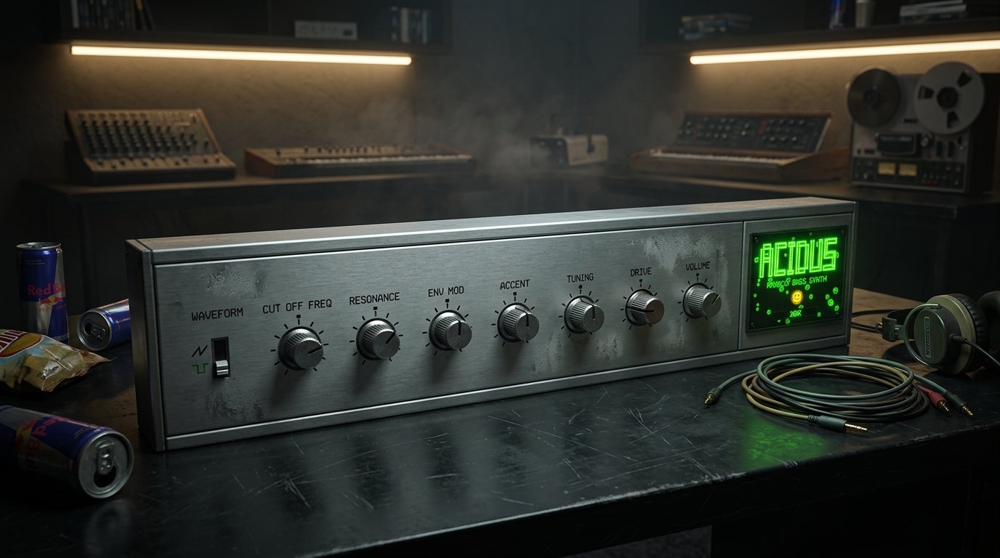
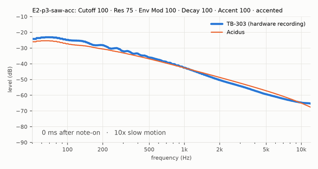
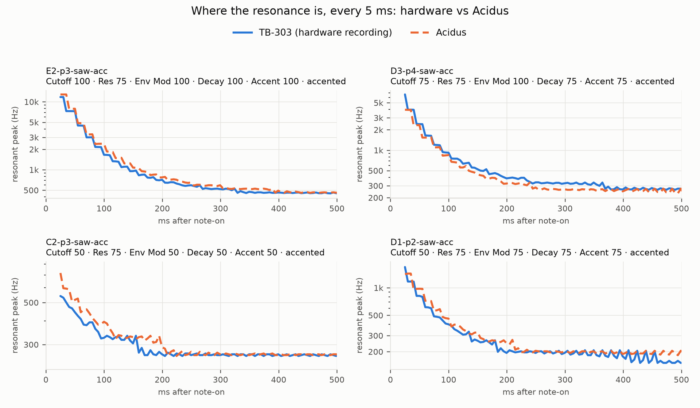
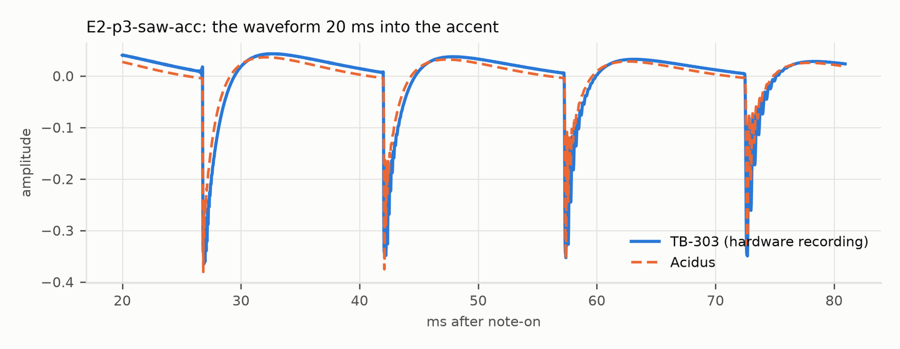

# Acidus



**Acidus** is a lightweight, faithful Roland TB-303 bass synthesizer emulator plugin written in modern C++17 using the [CLAP](https://cleveraudio-plug.info/) (Clever Audio Plug-in) standard.

---

## Key Features

- **Pure C++ DSP Engine**: Faithful 8x oversampled coupled diode ladder filter solver with physical BJT thermal voltage scaling and nonlinear saturation.
- **Calibrated against hardware**: fitted to 400 recorded notes of a real TB-303 and checked against the service-manual schematics (see below).
- **Four calibration presets**: two measured units, the schematic, and Hell Fish, a modded "ultimate 303".
- **MXR Distortion+ stage**: a circuit model of the pedal after the 303's audio-taper Volume knob, so Volume drives the pedal as on hardware, with an automatic output trim.
- **Custom Native Vector/Pixel GUI**: Lightweight pixel-rendered front panel featuring controls for Cutoff, Resonance, Env Mod, Decay, Accent, Waveform, Tuning, Volume, and Drive, plus a custom Acid Green logo with multi-layer glow.
- **CLAP Standard Support**: Full support for CLAP parameter automation, state save/restore, and host event flushing.
- **VST3 too**: both plugins are also built as VST3 (`acidus.vst3`, `burette.vst3`) by wrapping the same CLAP code with [clap-wrapper](https://github.com/free-audio/clap-wrapper).
- **Cross-Platform Support**: Linux (X11), Windows (Win32), and macOS (Cocoa).
- **303 accent latch over MIDI**: velocity 102 and up is an accent; polyphonic pressure (CLAP pressure note expression or MIDI poly aftertouch, not channel pressure) on the held note switches its accent on (>= 50 %) or off with no retrigger, as the 303's accent latch does under a held gate. Burette uses it to tell a same-pitch slide from a tie.
- **Burette**: a separate TB-303-style pattern sequencer plugin (`burette.clap`) that sends Acidus the notes it needs for real 303 gate, slide, tie and accent timing. See [Burette](#burette).

---

## Burette

*A burette is the lab tube that releases acid in measured drops; this one
releases it a 16th note at a time.*

`burette.clap` is a small note-output plugin, built separately so
`acidus.clap` stays the same size. Put it before Acidus in the same chain (or
route its note output to Acidus).

- **16 patterns**, up to 16 steps each, triggered by MIDI keys **C2 (MIDI 36,
  pattern 1) to D#3 (MIDI 51, pattern 16)**: the lowest keys of a standard
  61-key keyboard (DAWs that call middle C "C3" name these C1 to D#2).
  A pattern plays while its key is held; the newest
  held key wins, and a change takes effect at the next step. Releasing the key
  never cuts a step short: a started step plays out its gate, slide or tie.
- **Locked to the host.** Steps are 16th notes at the host tempo, on the
  host's grid: step *n* of the song plays pattern step *n mod length*, so
  starting playback anywhere (or looping) gives the same notes as playing
  through. Playback started mid-step begins at the next step. With the
  transport stopped, a trigger key starts the pattern at once from step 1.
- **303 timing** (`docs/TB-303 Reference/TB303_REFERENCE.md` §4):
  - normal steps gate for half a step;
  - **slide** holds the gate to the end of the step, and the next note-on is
    sent *before* the previous note-off, so Acidus glides without
    retriggering its envelopes. A slide on a tied note applies at the end of
    the tie, and a slide on the last step wraps to the first;
  - **tie** (`T`) extends the previous note's gate and keeps its accent
    (the 303's accent is latched);
  - **slide to the same pitch** sounds like a tie (no new note, no glide,
    no retrigger), except that it takes the slid-to step's accent: if that
    differs from the held note's, Burette sends polyphonic pressure on the
    held key (full for accent on, zero for off) and Acidus switches the
    accent mid-note. Note-ons and note-offs stay paired. On a real 303 this
    is how the accent latch behaves when a new note is clocked under a held
    gate; whether the 303's own firmware keeps such a step or folds it into
    a tie is unconfirmed. See `TB303_REFERENCE.md` §4.6 for the six
    combinations and the sources;
  - **accent** is velocity 127, other notes 100 (Acidus accents at 102 and up).
- **Pitch**: C..B and high C (C') with octave down / none / up spans C1-C4,
  the 303's range (C2 = MIDI 36 is the middle octave). On top come a
  per-pattern **transpose** and a global **KEY** transpose (both ±12
  semitones). KEY is an automatable host parameter, applied sample-accurately
  from the next note, like the 303's track transpose; editing it in the GUI
  records automation.
- **Pattern chaining** (the 303's track mode): each pattern's **NEXT** names
  the pattern played after it. Triggering A plays A > NEXT(A) > ... until a
  link is unset or points back into the chain, then loops from A. The chain
  counts as one long pattern on the host grid, and slides and ties carry
  across pattern boundaries.
- Other notes (outside MIDI 36-51) and MIDI (CCs etc.) pass straight through.

**VST3.** `burette.vst3` is the same plugin; it shows up as an instrument
with an event (MIDI) output. Route that output to Acidus; how depends on the
host (Reaper and Bitwig route VST3 note output, some hosts do not). The
accent change of a same-pitch slide is a pressure event; a host that does
not pass pressure from Burette to Acidus drops it, and that step then plays
as a tie.

**Editing.** Click a pattern number to edit it (the small FOLLOW light under
PATTERN makes the editor jump to the pattern that starts playing). In the
grid, left-click a cell for the next value, right-click for the previous one,
or left-drag up/down to scroll through them. Note cells go rest -> C ... B ->
C' -> tie; a tie is shown as a note cell without a name, a rest as a dark
empty cell. The LENGTH, TRANSPOSE, NEXT and KEY boxes work the same way;
steps past the length are shaded, and the pattern buttons of the edited
pattern's chain are underlined.

Along the top:

- **Play / pause** plays the edited pattern (its chain, if it has one) as if
  its trigger key were held: with the host stopped it runs at the host tempo,
  with the host playing it locks to the grid. Selecting another pattern while
  it plays switches at the next step. Pause shows while anything plays; it
  stops the play button's pattern, not the host's triggers.
- **The name**: click it and type (Enter keeps it, Escape cancels).
- **INIT** clears the edited pattern: click it once to arm it (SURE?) and
  again to clear.
- **Load / save** (the floppies, arrow out / in) read and write the whole
  pattern bank as a `.burette` file. On Linux the file dialog is zenity or
  kdialog, whichever is installed.
- **MIDI** (the blue tab): drag it onto a DAW track to drop the pattern as
  a MIDI clip: what triggering it plays, once (a whole chain for a chained
  pattern), with the KEY transpose. The clip has the 303 timing: half-step
  gates, accents at velocity 127, ties as long notes, slid notes
  overlapping the next note by 1/48 beat so a mono synth glides on playback,
  and a same-pitch slide's accent change as poly aftertouch on the held note.

All 16 slots hold original demo patterns, each showing a 303 technique:
octave jumps, accent grooves, pedal notes, tied drones, rolling 16ths, acid
house rests, a legato slide melody, stabs, a 7-step pattern against the bar,
an arpeggio, high-register squeal, and two chains (6 > 7, and call and
response 15 > 16).

---

## How Acidus is calibrated against real TB-303s

Acidus aims to sound like the hardware, not like a generic "303-ish" synth.
Two sources of truth drive the model:

1. **The circuit.** The DSP follows the TB-303 service-manual schematics and
   the published circuit analyses (see Credits). The findings are consolidated
   with evidence tags in `docs/TB-303 Reference/TB303_REFERENCE.md`, and
   `acidus_reference_test` checks the engine against them: filter poles and
   frequency response, resonance-loop stability, envelope and slide time
   constants, and control-law shapes.
2. **Recordings of real units.** Every constant the schematic leaves open
   (trimmer settings, pot tapers, component tolerances and ageing) is fitted
   to hardware recordings, never tuned by ear alone.

### Method

- **Reference sets.** 400 notes from the dinsync.info TB-303 reference
  recordings: all five knobs swept at five settings, saw and square, with and
  without accent, levels *not* normalised, so loudness is compared too. The
  set is described per note (knobs, sample ranges, measured timing and
  pitch) in `test/resources/x0x-reference/x0x_reference.md`, with a
  machine-readable manifest next to it. Plus 13 single-note samples from
  Acidvoice, from a second unit.
- **Measurement first.** Tuning, note-on grid, gate length and recording gain
  are measured, not guessed: all notes are C2 at +5.4 cents, and settings
  recorded twice repeat within 0.4 dB, so one global gain holds for all 400
  notes.
- **Rendering through the real engine.** `tools/calibrate_reference.py`
  renders every reference note through the plugin's own `SynthEngine` and
  compares harmonic levels, inter-harmonic content, loudness over time,
  1/3-octave spectrograms, and the **resonant-peak track**: where the
  resonance is, every 10 ms, which captures the Env Mod and accent sweeps.
  A CMA-ES search fits the constants. Held-out note subsets check that a
  fit generalises. Where a value can be read off the data directly (the
  square's duty cycle from its nulled 15th harmonic, the Decay pot's
  taper from the sweep decay times), it is measured rather than searched.
- **Per-unit profiles.** Units differ (the two measured here differ in
  cutoff range, accent level and envelope times), so fitted constants are kept per source in
  `calibrations/`, next to the schematic `factory` profile and Hell Fish
  (see below).

### Accuracy

Every reference note is rendered through the plugin's own engine and
compared with the hardware recording under a single recording gain for the
whole set, so loudness differences count too. Each unit is matched by its
own calibration profile:

| Metric | dinsync.info unit, 400 notes (`x0x`) | Acidvoice unit, 13 notes (`acidvoice`) |
|---|---|---|
| Harmonic levels, RMS error | 2.3 dB | 1.9 dB |
| Harmonics within 3 dB / 6 dB of the hardware | 76 % / 92 % | 77 % / 95 % |
| Resonant-peak shape, RMS error | 3.5 dB | 1.9 dB |
| Resonant-peak sweep, RMS error (Resonance >= 50 %) | 3.2 semitones | - |
| Note loudness, RMS error across notes | 1.3 dB | 2.6 dB |
| 1/3-octave spectrogram, RMS error | 5.6 dB | 5.0 dB |

**A squelch in slow motion.** One accented note at full Cutoff, Env Mod,
Decay and Accent with Resonance at 75 %: the spectrum of the hardware
recording and of Acidus, 30 ms windows, the first 600 ms played back ten
times slower.



**Where the resonance is.** The resonant peak tracked every 5 ms through
the envelope sweep, on four accented notes:



**The waveform.** The same squelch 20 ms into the accent, sample for
sample:



The figures are regenerated from the recordings and the current engine by
`tools/make_readme_figures.py`.

The `factory` profile passes 30 of the 34 schematic conformance checks in
`acidus_reference_test`. Cross-unit scores and per-set results are in
[`calibrations/README.md`](calibrations/README.md).

### Circuit behaviour measured from the recordings

Fitting against a systematic sweep pins down behaviour the schematic alone
leaves open, and all of it is in the model:
- the Env Mod pot's S-shaped depth curve (steepest around 69 % of travel)
  and its bias shift, which lowers the settled cutoff by 0.35 x the added
  sweep depth;
- the Decay and Env Mod pots' real audio taper (about 15-20 % at
  mid-travel, two-segment carbon pots, not an ideal exponential);
- the Resonance pot's late build-up, which matches the linear VR4a loaded
  by the Q18 buffer within 1 %;
- the square's 53 % duty cycle at C2;
- the accent diode D24's forward drop, which, with a moderately aged C13,
  makes this unit's accent squelch peak 15-20 ms after note-on;
- a ~4.5 ms delay before the VCA opens on unaccented notes;
- a filter cutoff that reaches beyond 15 kHz at full Env Mod.

### Calibration profiles

No two TB-303s sound exactly alike: trimmers, ±20 % electrolytics, carbon
pots and 40 years of ageing all leave their mark. Acidus keeps one circuit
model and stores the constants that differ between units as profiles in
`calibrations/`, built into the plugin as presets. The current preset is
shown on the logo plate; **click it to switch**. The knobs keep their
positions, and the preset is saved with the project. In the calibration
build, a star after the name means a calibration parameter was changed
after the preset was loaded.

| Profile | What it is |
|---|---|
| `x0x` (default) | The dinsync.info unit as recorded: 40 years old, low cutoff trim, aged C13. Best fit to its 400 notes. |
| `acidvoice` | The Acidvoice unit: the same circuit model fitted to its 13 samples; higher cutoff range, louder accent. |
| `factory` | The schematic: every value the schematic, parts list or service manual fixes (component values, trims, ladder capacitors and orientation, filter-to-VCA taps). Passes 30 of 34 conformance checks. |
| `hellfish` | Hell Fish, the ultimate 303: the schematic core with Devil Fish ranges and popular community mods (self-oscillating resonance, wider cutoff, deeper Env Mod, bass mod, harder accent, filter overdrive). Tuned for sound, not modelled on a unit. |

Every knob law and calibration constant, its circuit part, schematic value,
measurements, per-profile value and audible effect is explained in
[`docs/CALIBRATION_PARAMETERS.md`](docs/CALIBRATION_PARAMETERS.md). The x0x
fit's procedure and per-set results are in
`docs/X0X_CALIBRATION_2026-09-28.md`.

### Known limits

- High Resonance with high Env Mod: the resonance is slightly weak in the
  attack.
- The x0x set is all C2, so key tracking is constrained by the circuit, not
  by recordings.
- The coupling network around the filter follows Open303's empirical
  topology rather than Stinchcombe's full network, which accounts for the
  four conformance checks `factory` does not pass (resonant-peak height,
  low-frequency shape, square edge ringing, fast MEG term in the VCA).

---

## Building

### Prerequisites

- CMake (>= 3.15; >= 3.21 for the VST3s)
- C++17 compliant compiler (`GCC`, `Clang`, or `MSVC`)
- Linux: `libx11-dev`

### Build Steps

```bash
git submodule update --init
cmake -B build -DCMAKE_BUILD_TYPE=Release
cmake --build build
```

The resulting CLAP plugins (`acidus.clap` and the sequencer, `burette.clap`) will be located in the `build/` directory.

The VST3 plugins, `acidus.vst3` and `burette.vst3`, are built next to them
(on Linux and with multi-config generators such as Visual Studio, under
`build/Release/`). They are self-contained: the CLAP code is linked in, no
`.clap` file is needed. On Linux and macOS a `.vst3` is a folder (bundle);
copy the whole folder to your VST3 directory.

The VST3s are made with the `clap-wrapper` submodule. Configuring downloads
the VST3 SDK (MIT licensed) from GitHub; to use a local copy instead, pass
`-DVST3_SDK_ROOT=/path/to/vst3sdk`. To build only the CLAPs, pass
`-DACIDUS_BUILD_VST3=OFF`.

### Calibration build

By default the plugin only exposes the eight front-panel controls (including
a Tuning trim, ±700 cents to match the real hardware's documented trim
range -- useful for nudging the plugin into tune against a reference
hardware recording that's itself slightly off-pitch) as CLAP parameters,
matching the real hardware's user-facing surface. A separate build
configuration additionally exposes every hidden circuit-topology constant
(ladder coupling-pole corners, VCA saturation drive, etc.) as automatable
CLAP parameters under `Experimental/...` module paths, each spanning the
full plausible range documented in `docs/CALIBRATION_PARAMETERS.md`, so an
external fitting/optimization tool -- or a human A/B-ing against a reference
hardware recording -- can push every free constant in the model to its
documented extremes:

```bash
cmake -B build-calibration -DCMAKE_BUILD_TYPE=Release -DACIDUS_CALIBRATION_BUILD=ON
cmake --build build-calibration
```

Nothing in the DSP core depends on which configuration is used -- the
calibration build is the exact same signal path, just with more of its
constants exposed as host-automatable parameters instead of compiled-in
defaults. See `docs/CALIBRATION_PARAMETERS.md` for what each one backs.

### Calibrating against hardware reference samples

`tools/calibrate_reference.py` fits the model to the hardware TB-303 notes in
`test/resources` (file-name format: `test/resources/reference_resources.md`).
It renders each note through the real `SynthEngine` (via the
`acidus_calibration_render` shared library, built automatically), and runs a
time-capped CMA-ES search over every model constant in `SynthParameters`,
the hardware knob positions and the note timing. It compares full-note
harmonic levels, inter-harmonic content, RMS envelopes and 1/3-octave
spectrograms.

```bash
pip install numpy matplotlib        # matplotlib optional (plots)
python3 tools/calibrate_reference.py                     # 20 min cap, 4 min patience
python3 tools/calibrate_reference.py --evaluate-only     # score the current code
python3 tools/calibrate_reference.py --exclude c5r1 --apply   # drop a suspect sample, write defaults
```

The dinsync.info reference set in `test/resources/x0x-reference` (25 files x
16 notes: a systematic sweep of every knob, both waveforms, with and without
accent, levels not normalised) is described in
`test/resources/x0x-reference/x0x_reference.md` and, machine-readably, in
`x0x_reference_manifest.json` next to it. Both are generated from the
author's knob chart and the audio by `tools/x0x_reference_manifest.py`.
`--manifest` fits against those notes instead (with one global recording
gain, so absolute levels count):

```bash
python3 tools/x0x_reference_manifest.py                  # regenerate manifest + tables (--check: verify)
python3 tools/calibrate_reference.py --manifest --evaluate-only --no-sensitivity
# fast search: a quarter of the notes (--rotate), first 800 ms of each
python3 tools/calibrate_reference.py --manifest --rotate --analysis-ms 800 --no-sensitivity --max-minutes 120
```

`--include`/`--exclude` then match note ids such as `C2-p3-square-acc`.

To calibrate against a new source (more samples, a hardware unit or clone, a
software plugin, or found samples with video evidence of the knobs), follow
[`docs/CALIBRATION_COOKBOOK.md`](docs/CALIBRATION_COOKBOOK.md): what to record, how
to name and place the files, the knob sheet and manifest
(`tools/make_reference_manifest.py`), the fit, how to judge it, and how to turn it
into a plugin preset.

Fitted constants are kept per source in `calibrations/` (`x0x`, `acidvoice`,
`factory`, `hellfish`) and compiled into the plugin's presets with
`tools/calibration_profile.py presets`; `calibrations/README.md` explains
what differs between them.

Results go to `calibration_results/<timestamp>/`:
- `report.md` has before/after scores, a per-sample ranking and a list of
  suspicious samples. Samples are flagged when they fit much worse than the
  rest, when a free knob fit moves far from the label, or when two samples
  with different labels sound identical.
- `synth_parameters.txt` is paste-ready C++ for `SynthParameters`.
- `result.json`, plus `renders/` with hardware/before/after audio and plots.

### Running Standalone Test Executables

```bash
./build/acidus_dsp_test
./build/acidus_filter_stability_test
./build/acidus_gui_test
./build/acidus_reference_test    # checks the DSP against docs/TB-303 Reference/TB303_REFERENCE.md
./build/burette_test             # sequencer timing, host sync, state and GUI editing
```

`acidus_reference_test` measures frequency response, resonance-loop
stability margin, envelope/slide time constants and control laws against the
sourced claims in the consolidated reference, and exits with the number of
failed checks. `docs/TB303_REFERENCE_AUDIT_2026-09-27.md` describes each
check and its source.

---

## Credits

**Hardware reference recordings**
- **Din Sync** ([dinsync.info](http://www.dinsync.info/2010/02/tb-303-reference-recordings-for-x0xb0x.html)):
  *TB-303 reference recordings for x0xb0x builders* (2010), 25 sets x 16
  notes sweeping every knob of a TB-303, recorded without level normalisation.
  The backbone of the calibration (`test/resources/x0x-reference`).
- **Acidvoice** ([acidvoice.com](https://acidvoice.com/)): the TB-303
  single-note samples in `test/resources`.

The recordings remain the work of their authors and are included only as
calibration references.

**Circuit analysis and TB-303 research** (cited throughout
`docs/TB-303 Reference/TB303_REFERENCE.md`)
- Roland Corporation: TB-303 service notes and schematics.
- Tim Stinchcombe: analysis of the TB-303 diode-ladder filter (pole
  positions, full-model frequency response).
- Robin Whittle: TB-303 circuit write-ups and the Devil Fish documentation
  (envelopes, accent sweep network, slide).
- Robin Schmidt: **Open303**, whose source code and fitted constants were an
  important cross-check.
- The KVR Audio "Open303" thread contributors, especially **antto**,
  **mystran**, **aciddose**, **kunn**, **Gordonjcp**, **rv0** and
  **Mike Janney**, for hardware measurements and circuit insight.
- The sonic-potions "303 timing" paper (sequencer and slide timing).
- The x0xb0x project (Adafruit / ladyada) and its builders' community.

**Distortion (MXR Distortion+ emulation)**
- ElectroSmash's circuit analysis, the Aphelion / aionfx project
  documentation, Wampler DIY, and the diode-clipper modelling literature
  (Yeh et al.). See `docs/MXR_Distortion_Plus_Emulation_Compendium.md`.

**Tools**
- [CLAP](https://github.com/free-audio/clap) by the free-audio community.
- [clap-wrapper](https://github.com/free-audio/clap-wrapper) by the free-audio community, for the VST3 builds.
- The [VST3 SDK](https://github.com/steinbergmedia/vst3sdk) by Steinberg Media Technologies. VST is a registered trademark of Steinberg Media Technologies GmbH.

Roland and TB-303 are trademarks of Roland Corporation; MXR is a trademark
of Dunlop Manufacturing. Acidus is an independent project and is not
affiliated with or endorsed by them.

