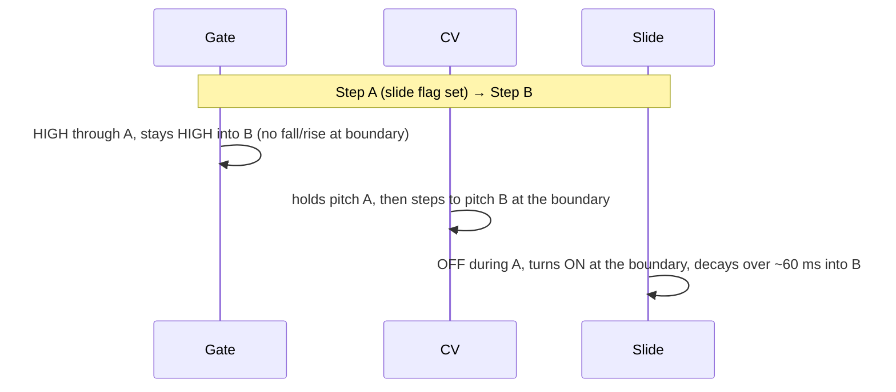
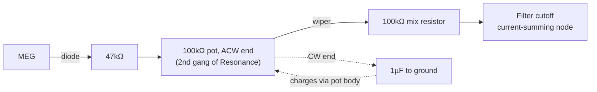
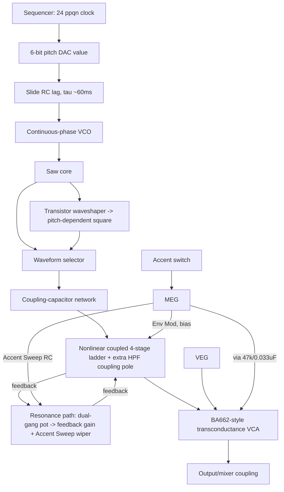

# TB-303 Hardware-Accurate Emulation Compendium

2026-09-18 · research notes supplied by the project owner

A circuit-informed reference for building a software emulation of the Roland TB-303 that reproduces its quirks, not just its block diagram.

This document is the **primary-source-grounded** counterpart to `TB303_EMULATION_REFERENCE.md` and `TB303_EMULATION_GUIDE.md`. Where either of those two disagrees with this one on a specific number, this document wins — its claims are sourced below (§15), and it explicitly separates "confirmed from the factory service notes / component-level circuit analysis" from "estimate" and "unsourced, possibly invented." See `TB303_PARAMETER_CONFIDENCE.md` for how these numbers map onto the actual C++ constants in `src/core/`.

## 1. Purpose, scope, and how to read this document

This compendium exists to support building a **circuit-informed** TB-303 emulation: one that reproduces the interactions between oscillator loading, the transistor/diode filter ladder, the Env Mod bias circuit, the two envelope generators, the dual-gang Resonance pot, the Accent Sweep capacitor, and the sequencer's gate/slide timing — not a generic subtractive synth tuned to sound "303-ish."

**On the supplied `TB303_EMULATION_REFERENCE.md`.** That file was AI-written, and you were right to flag it. Cross-checking it against the Roland service notes and the two primary technical sources (Tim Stinchcombe's filter analysis, Robin Whittle's circuit description) shows it is **broadly well-directed but imprecise on specifics**: its qualitative warnings ("don't use a fixed 46% duty cycle," "don't treat Env Mod as a Hz offset," "don't reset the accent-sweep capacitor between notes") are all correct and worth keeping. Its **numeric claims are a mix of real hardware values, values borrowed from other sources (some from the Devil Fish mod, not the stock 303), and invented-sounding round numbers** it presents with unwarranted confidence (e.g. "VEG decay 3–4 s," "gate-off tail ≈16 ms", generic "6 further poles"). Section 12 lists the specific corrections. Where this document and the reference file disagree, trust this document — its numbers are sourced below.

**Primary sources used here** (full citations in §15):

- Roland TB-303 Service Notes, Feb. 19 1982 — the factory schematic/calibration document. The only source with real component values and trim procedures; treated as authoritative below.
- Tim Stinchcombe's diode-ladder filter analysis — the only rigorous transfer-function derivation of the VCF.
- Robin Whittle's TB-303 circuit writeups (developer of the Devil Fish mod) — the primary source for the Accent Sweep circuit, MEG/VEG naming, and slide behavior. His **Devil Fish** documentation is also cited where useful, but Devil Fish values are explicitly marked as *modified*, not stock.
- A university teaching text (Olney, *ct-modular-book*) that independently corroborates several of Whittle's claims via a modular-synth reconstruction exercise.

**What's still genuinely uncertain.** No public source gives full SPICE-level component values for every ladder stage, exact trim-pot taper curves, or a verified BA662A datasheet (Rohm never published one openly; the closest surviving primary document is Behringer/Music Tribe's reissue datasheet for the V662A, the modern pin-compatible part). Where a number below is an estimate rather than a documented spec, it's marked *(approx., not directly sourced)*.

## 2. Global electrical, mechanical and connection specs

From the factory Service Notes (First Edition, Feb. 19 1982):

| Spec | Value |
| --- | --- |
| Pattern memory | 64 patterns (8 × 2 pattern sections × 4 pattern groups) |
| Pattern length | 1–16 steps (2/3/4 meter) |
| Track memory | 64 measures/track × 7 tracks = 256 measures total |
| Pitch scale | 3 octaves per pattern (with Transpose); 4 octaves per track (with Key Shift) |
| Tuning control range | approx. ±700 cents (a perfect fifth) |
| Tempo control range | quarter note = 40–300 BPM |
| Audio output impedance | 10 kΩ |
| Headphone output impedance | 8–30 Ω |
| Gate Out | OFF = 0 V, ON = +12 V |
| CV Out | +1 V to +5 V, 1 V/octave |
| Mix In (external audio) | 100 kΩ impedance, unity gain |
| Sync | DIN connector (in/out) |
| Power | 6 V from 4× 1.5 V batteries, or 9 V AC adaptor; draws 80–120 mA |
| Dimensions / weight | 300(W) × 146(D) × 55(H) mm, 1.0 kg |

**Internal bias rails** (referenced in the schematic silkscreen): approximately **+12 V**, **+6 V**, and **+5.333 V**, plus other local bias points around the VCF and VCA stages. The 5.333 V rail is real (confirmed against the service-notes scan) — the earlier reference file's "+12 V / +6 V / +5.333 V" list is accurate on this point.

**CPU / sequencer electronics** (context, not audio-relevant, but useful for anyone also emulating the sequencer): a µPD650C-133 4-bit CMOS microcontroller plus µPD444C CMOS RAM drive the pattern memory and the 6-bit pitch DAC referenced throughout this document.

## 3. Sequencer clock, gate and slide timing

This is one of the best-documented parts of the machine (Whittle, corroborated independently by Olney) and should be implemented exactly, not approximated as a percentage of step time.

**Clock structure.** 24 clock pulses per quarter note → 6 clock pulses per 1/16 note. This is the base timing unit for gates and slides.

**Normal gate (non-slide, non-extended note).** Gate rises at clock pulse 0 of the step and falls halfway through clock pulse 3. That is **3.5 of 6 clock pulses ON, 2.5 OFF** — not a 50/50 split. This is what gives the 303 its characteristic short, staccato feel even at slow tempos.

**Extended / tied notes** (a step marked "continue" rather than a fresh note): the gate simply doesn't fall at the 3.5-pulse mark — it runs through into the next step's gate logic, merging into one long gate.

**Slide.** The slide flag is stored on the *first* note of a tied pair but the slide itself — the portamento — **starts at the beginning of the following (second) note**, not at the start of the note that has the flag. Concretely, for `Note A [slide] → Note B`:

- Note A plays normally.
- At B's step boundary: gate stays continuously high (no new gate edge), CV steps to B's programmed pitch, and the pitch-lag circuit (§4) begins slewing from A's pitch toward B's.
- MEG and VEG are **not retriggered** — they continue their existing envelope trajectory uninterrupted.
- The oscillator is not phase-reset.

Whittle's own timing diagram (reproduced schematically):

**Rests.** A rest removes the gate/note event entirely — the VCA undergoes its normal gate-off decay (§8). A rest is not "a very low, silent note"; there is no note-on/off pair to speak of at all for that step.

This timing model — clock-pulse-accurate gates, slide anchored to the *following* note, no envelope retrigger on slide — is the single most load-bearing part of getting the 303's feel right, more than any filter-model detail. Several credible sources (Whittle, Olney's independent reconstruction) agree closely here, so treat §3 as high-confidence.

## 4. Oscillator (VCO)

A single continuously-running analogue saw-core oscillator. There is no second oscillator, no detune, no hard sync/reset on note-on — pitch changes are applied to a running oscillator via the control-current path, and phase continues through both normal retriggers and slides. This matters for attack transient shape and is one of the reference file's more defensible claims.

**Pitch system.** 1 V/octave, driven by a 6-bit pitch DAC (confirmed by the service notes' CV-Out spec: +1 V to +5 V range, 1 V/octave). The factory CV calibration procedure is exact and worth reproducing as a *design constraint*, not just historical trivia: with the machine in Pitch mode, low-C gives a reading CVL; high-C is trimmed (TM6) to CVL + 1.000 V ± 3 mV; pressing Transpose-Up + high-C must then read CVM + 1.000 V ± 3 mV. In other words, **the octave is exactly 1.000 V, calibrated to a 3 mV tolerance** — treat this as the ground truth for any MIDI-note-to-CV mapping (a 3 mV/octave-class rounding error is small enough to be inaudible and is a reasonable target for "in-tolerance" emulation).

**Factory VCO calibration procedure** (Service Notes, page "VCO"), useful as a reference for what "correctly calibrated" means and as a target for a software calibration mode:

1. Set TUNING to center.
2. In Pitch mode, alternately tap the low-C and high-C keys and adjust the WIDTH trim (TM5) until the two octaves' waveforms match in a 2:1 ratio.
3. Press the A key and adjust the reference trim (TM4) for exactly **110 Hz**.
4. Confirm, using Transpose-Up with low-C/high-C, that the two-octave interval measures **4:1 ± 0.5%** (i.e. two octaves = ×4 frequency, matching a true 1 V/octave law).

This directly confirms the reference file's "A = 110 Hz, octave ratio 4:1" claim — that part of the AI-written file is accurate and taken straight from the service notes' own language.

**Implementation guidance.** Model the oscillator as a continuous phase integrator (ramp with reset-on-threshold), not a wavetable restarted per note. Because there is no filter-cutoff keyboard tracking on the 303 (§6), the oscillator's only job is pitch + waveform generation; it does not need to interact with the filter's frequency control at all, only with the filter's *input level and spectral content* (§5).

## 5. Saw and square waveforms

**Square is derived from the saw**, via a transistor waveshaping stage — it is not an independent oscillator output, and it inherits the saw core's amplitude/offset quirks. Do not implement it as a mathematically pure ±1 square.

**Duty cycle is pitch-dependent, not fixed.** Per Whittle (independently cited by Olney): duty cycle is around **45%** at higher pitches and widens to roughly **70–71%** at the lowest oscillator frequencies. A fixed 46% duty cycle (as claimed by some generic "303 emulator" DSP writeups, and flagged for removal in the reference file) is not accurate across the playable range. A pitch-dependent curve or PWM-style modulation driven by the pitch CV is a reasonable approximation if full transistor modeling isn't feasible.

**The saw/square "looks high-passed" observation.** Olney's analysis of the Din Sync reference recordings found something worth building into the model directly: neither waveform matches its textbook shape, and — empirically — **a high-passed square resembles the reference saw, and a high-passed saw resembles the reference square**, at a corner in roughly the 80–115 Hz region (their reconstruction used cutoffs around 82–115 Hz, tracking pitch). The reference file's advice not to bolt on "a dedicated 150 Hz HPF on the square only" is directionally correct — the effect isn't square-specific, it applies to both waveforms via the shared coupling-capacitor network between VCO and VCF input — but the reference file's specific "150 Hz" figure appears to be invented; **80–115 Hz, tracking pitch**, is the better-supported region, and it should emerge from an explicit coupling-capacitor model (§6) feeding both waveforms, not a bolted-on filter.

**Drive-level asymmetry.** Saw and square should be calibrated with independent, non-normalized amplitudes (measured or estimated relative levels, not both forced to peak=1.0) before the VCF, since the nonlinear ladder responds very differently to the two waveforms at the same knob settings — this is a real and audible effect, not something to "fix" with post-filter gain compensation.

## 6. VCF topology, pole structure, and the 18 dB vs 24 dB question

**Structure.** A four-stage ladder using transistors wired to act as diode elements (a diode-ladder derivative of the Moog transistor ladder, built to work around Moog's ladder patent — see Stinchcombe and multiple corroborating sources). Unlike the Moog ladder, the stages are **not isolated by unity-gain buffers**, so each stage loads its neighbors — this loading is structurally central and shouldn't be approximated away.

**Is it 18 dB or 24 dB?** This is a genuinely contested point across sources, not a settled fact — say so plainly rather than picking a side silently:

- It is **physically a 4-pole (24 dB/octave) filter** — this is what you get from counting ladder capacitors, and it's what Stinchcombe's transfer-function derivation and Wikipedia's spec sheet both state.
- It is **commonly called "18 dB"** in Roland-era and enthusiast literature. Stinchcombe's own explanation, echoed by Olney: the four poles are **not evenly spaced** (see below), so the roll-off *behaves* closer to 18 dB/octave over much of the audible transition region even though it's asymptotically 24 dB. There's also a plausible legal-cover theory (avoiding an explicit comparison to the patented Moog ladder) that no source can confirm.
- The reference file's uneven-pole claim ("−0.13, −1.04, −2.33, −3.24" normalized) is a reasonable illustrative idealization but **should not be presented as measured data** — it isn't sourced to a real derivation that could be verified; treat it as a plausible *shape* (first pole well separated from the other three) rather than exact numbers.

**The filter is more than 4 poles — but the numbers commonly repeated need care.** Stinchcombe's analysis (as summarized by secondary sources, since his page itself blocks automated fetching — see §15) identifies **additional high-pass/coupling poles from the capacitor networks surrounding the core ladder**, whose combined effect resembles a high-pass filter in series with the main low-pass, and which itself becomes resonant as Resonance is increased — boosting/shaping the low end rather than just rolling it off. Sources disagree on the exact count and corner: one secondary summary says "six further poles" with the composite HPF effect centered near **8 Hz**; the Electronic Music Wiki cites **10 Hz** for the resonant peak. **Treat "6 poles" and the exact 8 vs 10 Hz corner as approximate/order-of-magnitude, not verified constants** — this is exactly the kind of specific-sounding number that gets stated with more confidence than the sources actually support. What's solid across all sources: there *is* a low-frequency coupling/resonance structure around single-digit-Hz to low-tens-of-Hz that (a) attenuates deep bass more than a clean digital ladder would, and (b) becomes resonant and boosts sub-100 Hz content as Resonance increases — this is the mechanism behind the well-documented "resonance causes bass loss, except right around the boosted coupling-pole region" behavior. Model it as an explicit extra HPF stage inside the resonance feedback loop, tunable in the single-digit-to-low-tens-of-Hz range, rather than a fixed number.

**Self-oscillation.** Wikipedia's spec sheet explicitly states the stock filter is **non-self-oscillating** — corroborating the claim that a stock 303 doesn't cleanly self-oscillate like a Moog ladder at max resonance. Very high resonance + high cutoff + drive can approach instability without a hard clamp, but a clean sustained sine at Resonance=max is not stock behavior and, if an emulation produces one, that's a sign the ladder loading/coupling model is too clean.

**Implementation implication.** A coupled nonlinear state-space ladder (bidirectional stage loading, not independent cascaded one-poles with post-hoc saturation) plus an explicit low-frequency coupling/resonance stage inside the feedback path is the right shape of model. The exact pole locations and coupling-pole count should be treated as tunable calibration parameters validated against recordings, not hard-coded from any one secondary source's numbers — including this document's.

## 7. Resonance circuit

**The Resonance pot is confirmed dual-gang from the factory parts list**, not just claimed by secondary sources: the Service Notes' potentiometer parts list includes a line for `K162T00W-50KB ×2` — a matched pair of 50 kΩ pots ganged on one shaft, distinct from every other single-section pot in the list. This directly corroborates both the reference file's claim and Whittle's account.

- **Section 1** sets the ordinary filter-feedback level ("resonance" in the conventional sense).
- **Section 2** sets the position of the wiper in the Accent Sweep RC network (§9) — i.e., turning the Resonance knob simultaneously changes ordinary resonance *and* how sharp vs. smoothed the accent filter-sweep is. These two effects are mechanically coupled and must be modeled as one control driving two destinations, not two independent parameters that happen to share a name.

**Feedback path character.** Resonance is an analogue feedback loop around the nonlinear ladder, not a textbook Q parameter — feedback gain, feedback nonlinearity, and the low-frequency coupling-pole resonance (§6) all interact with cutoff and drive level simultaneously. Increasing resonance measurably reduces passband/bass gain except in the boosted coupling-pole region — this "resonance steals bass, except right around the sub-audio hump" behavior is one of the most load-bearing, well-corroborated (Stinchcombe, secondary summaries, Eddy Bergman's DIY build notes) characteristics of the filter, and a linear-Q resonant ladder will not reproduce it.

## 8. Envelopes: MEG and VEG

Two envelope generators, both named by Whittle and used by every subsequent source:

|  | MEG (Main EG) | VEG (Volume EG) |
| --- | --- | --- |
| Drives | Filter cutoff (via Env Mod pot) | VCA only |
| Shape | Sharp attack, exponential decay | Sharp attack, exponential decay |
| Decay control | Front-panel Decay pot (normal notes); shorted to a short fixed time on accented notes (§9) | **Fixed** — no front-panel control at all |
| Panel exposure | Decay knob | None |

**MEG decay range.** The reference file's "≈200 ms to ≈2–2.5 s" is plausible but not independently confirmed against the stock service notes (the trim in the calibration procedure sets a *transient/oscillation* target at the VCF trimmer, not the decay pot's end-stop times directly). The Devil Fish manual, by contrast, explicitly documents its *own modified* Normal/Accent Decay range as **30 ms – 3 s** — but that is a Devil Fish figure, not stock, and should not be copied into a stock emulation without labeling it as such. Treat the stock Decay pot's exact end-stops as an open, uncited number; **200 ms–2 s is a reasonable working target**, consistent with community consensus, but calibrate it against a reference recording if possible rather than treating either number as gospel.

**VEG decay.** No source found gives a specific stock time constant with real citation weight (Whittle just says "rather long"). The reference file's "3–4 seconds" should be treated as **an estimate, not a documented spec** — flag it internally as approximate rather than hard-coding it as fact.

**Env Mod bias circuit — this part of the reference file is well-supported.** The Service Notes include an explicit section titled "VCF Envelope Modulation" describing exactly the mechanism the reference file paraphrases: a conventional envelope-into-cutoff design wastes most of its travel opening the filter further than matters perceptually, so the 303 adds a bias transistor (**Q9**) that sets the *center* of the cutoff range so that a *small* Env Mod voltage swing produces an *appreciable* audible sweep. Turning the Env Mod pot's wiper toward one terminal both increases the envelope's voltage reaching the bias transistors **and** shifts the bias point (equivalent to also nudging Cutoff counterclockwise) — and the whole conversion from control voltage to filter current is explicitly **anti-log (exponential)**, done by a pair of transistors (Q10/Q11) acting as a log/antilog current converter. This is real, documented circuit behavior — implement Env Mod as a bias-shifting nonlinear current contribution exactly as described, not as `cutoff_Hz += envelope * depth`.

**Gate-off / retriggering behavior.** Both envelopes are capacitor-based analogue states that are **not force-reset at gate-off or at every new note** — a closely-spaced retrigger starts from whatever the capacitor hasn't yet discharged to, not from zero. This claim (from Whittle, and implicit in any RC-envelope circuit) should be modeled as continuous state carried between note events; no source gives a precise "gate-off tail is X ms" figure with real backing, so treat "≈16 ms / 8+8 ms" as an unverified estimate, not a spec.

## 9. Accent: VCA path and the Accent Sweep circuit

This is the best-documented non-obvious subsystem in the machine — Whittle's original writeup (quoted directly by multiple secondary sources, and independently reconstructed by Olney) gives exact component values. Treat this whole section as high-confidence.

**Accent is a discrete per-step flag, not velocity.** On an accented note, three things happen simultaneously, all sourced from the MEG through a switch that is only closed during accented steps:

1. **MEG decay override.** The Decay pot is bypassed; MEG runs at the same short, fixed decay time it would use if Decay were fully counterclockwise.
2. **Accent → VCA.** The MEG's (now short) envelope is added to the VCA control current, through an RC network of **47 kΩ + 0.033 µF** that softens the attack. This is the primary reason accented notes are louder — it's a control-current summation, not a fixed +6 dB gain multiply.
3. **Accent → filter, via the Accent Sweep circuit** (below).

**Accent Sweep circuit — exact topology (Whittle):** MEG output → diode → 47 kΩ → the anti-clockwise end of a 100 kΩ pot (this pot is the **second gang of the Resonance pot**, §7) → the pot's wiper feeds a 100 kΩ mixing resistor into the filter's cutoff-current summing node. A 1 µF capacitor to ground hangs off the *clockwise* end of that same 100 kΩ pot.

**How Resonance position reshapes the sweep:**

- **Pot near anti-clockwise (low Resonance):** the MEG reaches the filter almost directly — the accent is a sharp, fast filter "kick," since little current is diverted into charging the 1 µF cap.
- **Pot toward clockwise (high Resonance):** more of the accent current charges the 1 µF cap first, so the filter receives a smoothed, delayed, curved control signal — this is the source of the classic "wow"/"wapp"/rubbery accent character that gets stronger as Resonance is turned up.

**Capacitor memory — the rising-accent-peak effect.** The 1 µF cap does **not** fully discharge between closely-spaced accented notes. Consecutive accents (`A A A A`) therefore produce a *rising* series of filter peaks as residual charge stacks — described by Whittle in almost onomatopoeic terms as sounding like an increasingly distressed cry, and it's specifically why this circuit must be modeled as **persistent state that is never reset at note boundaries**.

**Approximate time constant.** 47 kΩ + 1 µF gives τ ≈ 47 ms for the direct charge path; the actual behavior is further shaped by the 100 kΩ resonance-gang resistance and the diode's nonlinear conduction, so the effective time constant varies continuously with the Resonance setting rather than being a single fixed number — model it as an RC state variable with resonance-dependent coupling, not a fixed envelope shape.

**Ambiguity worth flagging for implementation.** Olney's independent modular reconstruction notes a genuine point of uncertainty in how the smoothed accent voltage combines with the normal MEG voltage at the filter's summing node — whether it's a hard switch between "smoothed" and "normal" paths, or an additive mix. Olney's own testing favored an **additive mix** on accented steps (since a hard switch to the smoothed-only path would wrongly *lengthen* the audible decay on accents, the opposite of the intended pluckier character). This is a reasonable implementation default, but note that it's an inference from behavior, not something either primary source states explicitly.

## 10. VCA: BA662A

The factory parts list confirms the chip and Rohm's own designation for it: **BA662(A)**, listed simply as "Vari-conductance amp." No original Rohm datasheet for the BA662 survives publicly. The best available primary document is Behringer/Music Tribe's 2020 datasheet for the **V662A**, explicitly built as the modern pin-compatible reissue for reproducing this exact chip in reissue hardware — treat it as the closest thing to a real datasheet, with the caveat that it's a reverse-engineered/reissue part, not the original Rohm document.

Per that datasheet, the architecture is: a **dual, low-noise, low-offset programmable operational amplifier** whose forward transconductance (gm) is set by an external control current, with open-loop gain determined by that control current together with an external gain-setting resistor (R_L). It's explicitly marketed for VCA, VCF, and VCO applications — i.e., it's a general-purpose current-controlled transconductance building block, not a VCA-only IC, and the 303 uses it specifically as a VCA. It includes a low-impedance output buffer.

**Implementation guidance.** Model it as a control-current-driven transconductance stage (gain ∝ some function of control current, not gain = raw envelope value), with finite control range and a soft ceiling on gain/output level rather than a hard linear multiply — `output = input * envelope` is an oversimplification, especially at accent-driven high control-current levels where nonlinearity is most audible.

## 11. Component and calibration reference tables

All drawn from the factory Service Notes parts list and adjustment procedure. Part numbers are given for anyone who wants to pull real datasheets for SPICE-level modeling.

**Front-panel potentiometers (main board):**

| Control | Roland part no. | Value / taper | Notes |
| --- | --- | --- | --- |
| Resonance | K162T00W-50kB ×2 | 50 kΩ, dual-gang | Confirmed dual-gang — 2nd gang drives Accent Sweep (§7, §9) |
| Tuning / Accent (shared physical style) | K161B0-50kB | 50 kΩ | Two separate single-gang pots of this part type appear in the list |
| Cutoff / Env Mod (shared physical style) | K161B0-50kA | 50 kΩ | Two separate single-gang pots of this part type appear in the list |
| Decay | K161100FAE-1MC | 1 MΩ | Exact taper letter uncertain from the scanned parts list |
| Volume | VM11R851A-5M1411-50kA | 50 kΩ |  |

Note: the parts list gives part numbers, not a labeled "this pot = this control" map — the control assignment above is inferred from matching value/taper patterns against the panel silkscreen adjacent to VR7 (Resonance) and VR8, and against community documentation. Confirm against a real schematic before treating the Tuning/Cutoff/Env Mod/Accent assignments as certain; only the **dual-gang 50 kΩ Resonance pot** is unambiguous.

**Semiconductors (main board):**

| Type | Part(s) | Role (as documented / inferred) |
| --- | --- | --- |
| VCA IC | BA662(A) | "Vari-conductance amp" — the VCA (§10) |
| CPU | µPD650C-133 | 4-bit CMOS microcontroller, sequencer |
| RAM | µPD444C | CMOS RAM, pattern memory |
| Op-amp | AN6562 | Dual op-amp, used in mixer/output stages |
| NPN transistors | 2SC945(P), 2SC2021(R), 2SD657(C) | General-purpose switching/amp stages |
| PNP transistors | 2SA733(P), 2SA937(Q), 2SB647(C), 2SB596(O) | General-purpose switching/amp stages |
| Dual-matched transistors | 2SC1583(F), 2SC2291(F) | Likely used where matched pairs matter (VCO core, VCF bias) |
| Dual-gate JFETs | 2SK30(TM)-Y, 2SK30(TM)-O | Matched-pair FETs, plausibly VCO/VCF front-end |
| Diodes | 1S2473 (Si), 1SS-133 (Si), 1S-188FM (**Ge**) | Note the presence of a **germanium** diode type alongside silicon types — Ge has a lower forward voltage (~0.3 V vs ~0.6 V Si); which diode is used where (ladder vs. accent-sweep vs. elsewhere) is not confirmed from this parts list alone, but it's a concrete reason not to assume every diode in the circuit has identical Vf |

**Factory calibration checkpoints** (from the adjustment procedure, useful as target behaviors for a software "calibration mode"):

| Trim | Check point | Target |
| --- | --- | --- |
| TM1 (Tempo) | TP1, Tempo fully clockwise | 8 ms ± 1 ms (period) |
| TM2 (Int. Clock) | TP2 | 16 ms ± 0.2 ms |
| TM4 (VCO ref.) | Q28 source / SI waveform pin | 110 Hz at the A key |
| TM5 (VCO width) | same | 2:1 waveform ratio between low-C/high-C taps |
| TM6 (CV cal.) | CV Out jack | low-C to high-C = +1.000 V ± 3 mV; two octaves = +2.000 V ± 3 mV |
| TM3 (VCF) | TP6, with Cutoff=center, Sawtooth, Resonance=full CW, Env Mod/Decay/Accent=full CCW | A specific transient/timing target (figure is present in the scanned service notes but was not legibly OCR'd in the copy consulted here — re-derive from a clean scan before relying on it) |

**Power rails (approximate, from schematic silkscreen):** +12 V, +6 V, +5.333 V, plus local bias points around the VCF/VCA (not individually documented in the sources consulted).

## 12. Corrections to the supplied AI-written reference file

The file's *don't-do-this* list (its §93/"Things Specifically Removed") is sound advice throughout and doesn't need correcting. The issues are in its *positive* numeric claims — several are stated with a confidence the underlying sources don't support, and a few borrow figures from the Devil Fish mod without labeling them as modified-hardware values. Below, only claims worth flagging:

| Reference file claim | Status | This document's position |
| --- | --- | --- |
| A = 110 Hz, octave ratio 4:1 | **Confirmed** | Matches the service notes' calibration procedure verbatim (§4) |
| Resonance is dual-gang 50 kΩ, 2nd section drives Accent Sweep | **Confirmed** | Matches the parts list part number and Whittle (§7, §9) |
| Square duty cycle ≈45% (high pitch) to ≈70% (low pitch) | **Confirmed** | Matches Whittle via Olney (§5) — the file's own "do not use 46%" framing is correct |
| Filter is 4-pole but often called 18 dB; poles unevenly spaced | **Partially confirmed** | The 4-pole/18 dB tension is real and contested (§6); the specific normalized pole values given (−0.13, −1.04, −2.33, −3.24) are an unsourced illustrative model, not measured data — don't hard-code them as ground truth |
| "Six further coupling poles," feedback HPF "in the region of low hundreds of Hz" | **Overstated precision** | Secondary sources put the composite coupling-pole HPF corner around **8–10 Hz**, not "low hundreds of Hz" — these are very different design targets. The file's own §13 warns against overly specific HPF-frequency claims, then its §10 makes one; treat §6 of this document as the corrected version |
| Accent Sweep: 47 kΩ, 1 µF, 100 kΩ pot, diode | **Confirmed** | Matches Whittle's circuit description exactly, including the anti-VCA-network's separate 47 kΩ + 0.033 µF (§9) |
| Slide time constant ≈60 ms | **Confirmed** | Matches Whittle's Devil Fish documentation, which explicitly states 60 ms is the *stock* value before the mod extends it (§3) |
| VEG decay 3–4 s | **Unsourced estimate** | No primary source gives a specific stock figure; treat as approximate (§8) |
| Gate-off VCA tail ≈16 ms ("8 ms + 8 ms") | **Unsourced estimate** | Not found in any source consulted; plausible order of magnitude but shouldn't be hard-coded as a spec (§8) |
| MEG decay range ≈200 ms–2.5 s | **Plausible but not directly verified** | The Devil Fish manual gives 30 ms–3 s for its *own modified* range — don't copy that as stock. Stock end-stops aren't nailed down by any source here (§8) |
| "Dual op-amp BA662A VCA" framing / general architecture claims | **Confirmed at chip level** | Real part, real "vari-conductance" description from the factory parts list and the closest surviving datasheet (§10) |

Everywhere the file gives a *qualitative* modeling instruction (model resonance as feedback not Q, model Env Mod as a bias shift not an offset, keep the accent-sweep capacitor as persistent state, don't reset envelopes on slide, use a coupled nonlinear ladder not independent cascaded stages) it is directionally correct and consistent with the primary sources gathered here. Where it fails is in inventing specific numbers to fill gaps that the primary sources actually leave open — the fix is to mark those as calibration targets to tune by ear/against reference recordings, not constants to hard-code.

**On `TB303_EMULATION_GUIDE.md`** (a separate, shorter AI-written document in this repo, not covered by the table above since it predates this compendium): it makes several of the *same class* of error, more specifically and with less hedging. In particular its fixed 14 kHz saw LPF, `f(x) = x - 0.05x²` saw distortion, fixed 45–47% square duty cycle, square-only 150 Hz HPF, 150→250 Hz resonance-swept feedback HPF, 0.01 µF/100 kΩ feedback-HPF component values, 10/15/33/10 nF ladder capacitor spread, 200 Hz→2.5 kHz cutoff range, +350 Hz Env Mod offset, 15% resonance→cutoff CV bleed, fixed +6 dB accent VCA boost, and 100–300 Hz accent cutoff-drift figure are **not corroborated by any source consulted for this compendium** — several are directly contradicted (fixed duty cycle, square-only HPF, fixed-dB accent boost), and the rest have no traceable origin in the Service Notes, Stinchcombe, or Whittle. Treat all of them as calibration knobs to tune by ear, not specs.

## 13. Suggested DSP architecture and algorithms

**Signal-flow order:**

**State to carry per voice** (never zeroed except at the specific hardware-equivalent triggers described in §3, §8, §9):

| State variable | Reset condition |
| --- | --- |
| Oscillator phase | Never (continuous, even across slides and retriggers) |
| Pitch CV (post-slide-lag) | Never reset; slews continuously toward target |
| MEG voltage | Only re-triggered on a genuine new-gate event, never on slide, never forced to exactly 0 |
| VEG voltage | Same as MEG |
| Accent Sweep capacitor voltage | Never reset at note boundaries — only its own RC charge/discharge dynamics apply |
| Filter ladder stage states (4×) | Never reset — they're the filter's actual analogue memory |

**Suggested processing order per oversampled tick** (oversample 4–8×, per uncontested standard practice for any nonlinear ladder/VCA — not specific to the 303):

1. Advance sequencer/gate/slide state at the host sample rate (not oversampled — this is control-rate).
2. Update pitch CV via the slide RC lag.
3. Integrate oscillator phase at the oversampled rate; generate saw, then derive square via a pitch-dependent waveshaper (duty cycle curve from §5).
4. Update MEG, VEG, and the Accent Sweep capacitor as RC state variables (exponential attack/decay; Accent Sweep charge/discharge per §9's approximate τ and Resonance-dependent coupling).
5. Sum filter control current: `I_cutoff = I_static(cutoff_pot) + I_env(meg, env_mod_pot, bias) + I_accent_sweep(accent_cap, resonance_gang2, accent_pot) + I_bias`, then convert to an effective cutoff via an exponential (anti-log) mapping — this current-domain summation, not Hz-domain addition, is important and matches the real circuit (§8's Env Mod section confirms the real circuit works this way).
6. Solve the coupled nonlinear 4-stage ladder implicitly (zero-delay-feedback / Newton-Raphson or fixed-point iteration) at the oversampled rate, including the extra low-frequency coupling/resonance stage from §6 inside the same feedback solve.
7. Feed the ladder output into a BA662-style transconductance VCA, with control current summed from VEG + the accent-derived MEG contribution (through the 47 kΩ/0.033 µF softening network).
8. Output/mixer coupling stage (some real low-frequency and high-frequency rolloff from the analogue output path — don't add artificial "warmth" on top of it).
9. Downsample to host rate.

**Nonlinearity placement.** Distribute nonlinearity through the signal chain rather than one output `tanh()`: waveshaper, each ladder stage's inter-stage voltage difference (not a single global saturator), the resonance feedback path, and the VCA's transconductance curve, each contribute. Allow asymmetric clipping (different positive/negative headroom) at the transistor stages rather than forcing a symmetric odd function everywhere.

**MIDI mapping (for a plugin, not the stock hardware behavior):** velocity should be ignored for ordinary notes by default, with an optional velocity-threshold-to-Accent mapping as a plugin convenience, clearly distinct from anything the stock hardware does — the 303 has no velocity-sensitive loudness mechanism at all.

## 14. Validation and test matrix

Order these from cheapest/most-diagnostic to most subjective, and validate each before moving to the next — a wrong low-level building block invalidates every test on top of it.

| Level | Test | What to check |
| --- | --- | --- |
| 1. Static oscillator | A key, Saw and Square, Resonance min, Cutoff fully open | Frequency = 110 Hz at A; duty cycle ≈45% at this pitch; waveform amplitude/DC offset differ between saw and square |
| 2. Pitch law | Sweep across the keyboard/MIDI range | Exactly 1.000 V (± the ~3 mV factory tolerance, as a target) per octave; no drift |
| 3. Filter, small-signal | Very low oscillator level, Resonance minimum | Confirms linearized pole positions/roll-off shape before nonlinearity is introduced (§6) |
| 4. Filter, large-signal | Resonance 25/50/75/100%, Saw vs Square | Saw and square should visibly/audibly drive the filter differently at identical knob settings (§5); resonance should reduce passband gain except near the low-frequency coupling-pole region (§6, §7) |
| 5. Self-oscillation boundary | Cutoff high, Resonance at max | Should approach but not cleanly self-oscillate into a pure sine the way a stock Moog-style ladder would (§6) |
| 6. Envelope | Decay min vs max, single notes | Attack is very fast (sub-10 ms feel) on both MEG and VEG; decay shape is exponential, not linear |
| 7. Gate timing | `C C C C C C` at various tempos | Gate ON:OFF ratio should be 3.5:2.5 of the 6-pulse step, not 50/50 (§3) |
| 8. Accent, single | Accent on vs off, fixed Resonance | Louder, shorter, brighter note; filter shows the distinctive curved (not angular ADSR-like) "wow" shape, more curved at high Resonance (§9) |
| 9. Accent, consecutive | `A A A A`, `A×8`, at Resonance 0/0.25/0.5/0.75/1 | Filter excursion should *rise* across consecutive accented notes at moderate-to-high Resonance — if every accent peak is identical, the Accent Sweep capacitor isn't being modeled as persistent state (§9) |
| 10. Slide | `C→G`, `C→C`, octave up/down, with and without slide flag | Slid note: continuous pitch glide (~60 ms lag), no new envelope attack, no oscillator phase discontinuity, gate stays high through the boundary (§3) |
| 11. Rests | Notes interspersed with rests | VCA undergoes its normal gate-off decay on a rest; no special-cased "silent note" behavior |
| 12. Full-mix comparison | A known reference recording (e.g. a well-documented reference line, or the Din Sync reference set if available) against the emulator at matched knob settings | Final sanity check once the above all pass individually |

A useful sanity habit: whenever a specific number from this document (or from the reference file) doesn't hold up against test 12, prefer re-tuning that number against a real recording over trusting any single written source, including this one — every source here, primary included, has gaps the factory schematic alone would resolve.

## 15. Sources

- Roland TB-303 Service Notes, First Edition, Feb. 19 1982 (factory schematic/calibration/parts-list document) — [archive.org text](https://archive.org/stream/synthmanual-roland-tb-303-service-notes/rolandtb-303servicenotes_djvu.txt), [PDF scan via synthfool.com](https://synthfool.com/docs/Roland/TB303/Roland%20TB-303%20Service%20Notes.pdf)
- Tim Stinchcombe, TB-303 diode-ladder filter analysis — [timstinchcombe.co.uk/index.php?pge=diode2](https://www.timstinchcombe.co.uk/index.php?pge=diode2) (the site blocks automated fetching; consulted here via corroborating secondary summaries — read it directly for the full derivation)
- Robin Whittle, "TB-303's unique sounds" (MEG/VEG naming, Accent Sweep circuit) — [tinyloops.com/tb303/sound_robin_whittle.htm](https://tinyloops.com/tb303/sound_robin_whittle.htm), also mirrored at [firstpr.com.au/rwi/dfish/303-unique.html](https://www.firstpr.com.au/rwi/dfish/303-unique.html)
- Robin Whittle, TB-303 slide timing diagram — [firstpr.com.au/rwi/dfish/303-slide.html](https://www.firstpr.com.au/rwi/dfish/303-slide.html)
- Robin Whittle, Devil Fish user manual (values explicitly marked as *modified*, not stock, throughout this document) — [firstpr.com.au/rwi/dfish/Devil-Fish-Manual.pdf](https://www.firstpr.com.au/rwi/dfish/Devil-Fish-Manual.pdf)
- Andrew Olney, *ct-modular-book*, Chapter 13 ("TB-303") — independent modular-synth reconstruction corroborating Whittle — [github.com/aolney/ct-modular-book/blob/master/13-tb-303.Rmd](https://github.com/aolney/ct-modular-book/blob/master/13-tb-303.Rmd)
- Wikipedia, "Roland TB-303" — [en.wikipedia.org/wiki/Roland_TB-303](https://en.wikipedia.org/wiki/Roland_TB-303)
- Electronic Music Wiki, "TB-303" (10 Hz resonance-peak figure, filter pole-count summary) — [electronicmusic.fandom.com/wiki/TB-303](https://electronicmusic.fandom.com/wiki/TB-303)
- Chris Meyer / Learning Modular, summary of Stinchcombe's coupling-pole analysis (8 Hz figure, "six further poles") — [patreon.com/LearningModular](https://www.patreon.com/LearningModular/posts/patch-ideas-i-tb-41917616)
- Behringer / Music Tribe, V662A datasheet (modern reissue of the BA662A) — [cdn.mediavalet.com … Datasheet_CA_V662A](https://cdn.mediavalet.com/aunsw/musictribe/MG0zPwOCgECHib5rnTL-rA/LXFVv3YzekKv8pRtNdQIzg/Original/Datasheet_CA_V662A_2020-10-12_Rev.0_Signed.pdf)
- Eddy Bergman, DIY TB-303 VCF build notes (component-matching methodology, corroborates the low-frequency resonance/bass-loss behavior) — [eddybergman.com/2025/03/TB303-VCF.html](https://www.eddybergman.com/2025/03/TB303-VCF.html)

**Note on `TB303_EMULATION_REFERENCE.md`:** treated throughout this document as a secondary, AI-generated source of unknown provenance — useful for its qualitative modeling instincts, cross-checked and corrected against the primary sources above wherever it made specific numeric claims (§12).
