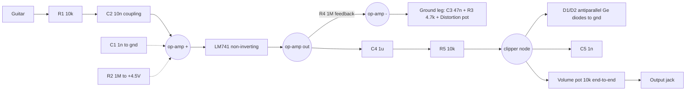
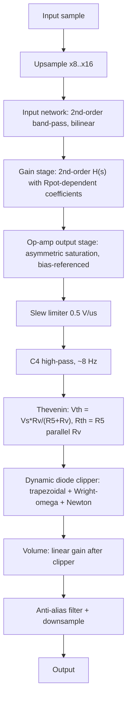

# MXR Distortion + Hardware-Accurate Emulation Compendium

2026-09-19

A circuit-informed reference for building a software emulation of the MXR Distortion + (M-104) that reproduces what the hardware actually does, not just "op-amp → clipper → volume".

## 1. Purpose, scope, and how to read this document

The Distortion + is one of the simplest famous distortion pedals: one LM741-class op-amp in a non-inverting gain stage, followed by a pair of germanium diodes to ground and a volume pot. Its simplicity is deceptive for emulation purposes, because three different mechanisms shape the sound at once and they interact: (1) a frequency-dependent gain stage whose **gain, bass-cut corner and treble roll-off all move together** with the Distortion knob; (2) at high gain, **hard saturation of the 741 itself** against its rails, so that the diodes are fed an already-squared wave; and (3) a **dynamic, low-knee germanium diode clipper** with a short RC time constant that is shaped by the volume pot's loading.

**Confidence legend used below.** *(sourced)* means a number or claim is stated by at least one retrieved source. *(computed here)* means I derived it from the sourced circuit and verified it numerically (Section 11 and the scripts summarised there). *(approx., not directly sourced)* means it is an engineering estimate, an assumption, or a parameter fit that must be calibrated against a real unit. Where sources disagree, the disagreement is stated rather than silently resolved (Section 10).

**Important limitation on the circuit itself.** The original MXR schematic is an image, and every source retrieved here gives it either as an image or in prose. The topology in Section 4 was reconstructed from ElectroSmash's textual description and then **cross-checked against an independent number**: the gain range that the Effects Database lists for the Dunlop M-104 reissue (10 dB to 45 dB at 1 kHz; I could not confirm it against Dunlop's own literature). The reconstructed topology with a 500 kΩ distortion pot reproduces that range (9.5 dB and 44.8 dB, computed here), which is good evidence the topology is right. It is *not* a substitute for tracing a real unit, and Section 8 lists what to measure.

**Primary and secondary sources used** (full list in Section 12): ElectroSmash's circuit analysis (the most detailed public analysis; hobbyist, not manufacturer); the Aphelion/aionfx project documentation (contains a component-variation table across MXR and DOD versions); Wampler DIY's analysis; several builder layout pages (tagboard / effectslayouts / Barbarach / StompBoXed) used mainly for component-value cross-checks; Wikipedia for history; the TI LM741 datasheet; and the academic literature on diode-clipper and op-amp modelling. **No paper specific to emulating the Distortion + was found** in the searches performed. The closest published work models the Boss DS-1 and Tube Screamer (Yeh et al.), which have their diodes in an op-amp *feedback* loop, unlike the Distortion +, whose diodes are a *shunt* clipper after the op-amp. The techniques transfer; the topologies do not.

## 2. History, versions and family tree

| Item | What sources say | Confidence |
| --- | --- | --- |
| Manufacturer | MXR Innovations, Inc. Company founded 1972 by Keith Barr and Terry Sherwood (as "Audio Services"); first effects pedals released 1974: Phase 90, Dyna Comp, Blue Box, Distortion + (Wikipedia, MXR) | sourced |
| Introduction year | **1974** (Wikipedia, MXR Distortion +; Wikipedia, MXR). The Aphelion documentation says "first came out in 1973". ElectroSmash says "1978–1979", which conflicts with everything else and is very likely an error (Section 10). | sourced, conflicting |
| Production eras | Script-logo units (early) then block-logo units. Wikipedia's MXR page gives "Block Logo Period 1 (1975–1981)" and "Block Logo Period 2 (1981–1984)"; a vintage-market article puts the script→block switch at "around 1977". Sources disagree on the dates. | sourced, conflicting |
| Sonic difference script vs block | One reviewer could not hear a meaningful difference; found script units "slightly better at fuzz... a little softer and less harsh". Anecdotal; no circuit differences documented. | anecdotal |
| End of MXR | Ceased manufacturing 1984; Jim Dunlop acquired the brand in 1987 and resumed production of classic MXR pedals (Wikipedia, MXR). | sourced |
| Reissue changes | Dunlop reissues add an LED and an external power jack (originals had neither) and use a redesigned PCB "while maintaining circuit topology" (Wampler DIY, ElectroSmash). Reported reissue specs: 9 V DC, 2.5 mA, "hardwire bypass" (Effects Database). | sourced |
| Randy Rhoads edition (RR-104) | Dunlop describes it as "painstakingly spec'd" from Rhoads' vintage unit; no component-level differences were retrievable (the product page and forum threads were blocked or non-specific). | unverified |
| Notable users | Randy Rhoads, Jerry Garcia, Bob Mould, Dave Murray (Iron Maiden), Steve Wynn, Thom Yorke, Rowland S. Howard, Slash (Wikipedia). Useful as reference-recording candidates for validation (Section 9). | sourced |

**Family tree.** The MXR **Micro Amp** is described by ElectroSmash as "an un-distorted redesign of the previous M-104 MXR Distortion +". The **DOD Overdrive 250** shares the same topology and appears in the same Aphelion component table (DOD 250 revisions from 1977 to 2002 differ mainly in op-amp: LM741 → LF351N → KA4558, and use 1N4148 silicon diodes instead of the MXR's 1N270 germanium). The **Pro Co RAT** is a contemporary that uses the same idea of shunt diodes to ground after a high-gain op-amp stage (LM308 rather than 741, silicon 1N4148 diodes, plus a tone control the MXR lacks) but is a different circuit. Treat the DOD 250 column of the Aphelion table as a source of *plausible variation ranges*, not as Distortion + data.

## 3. Global electrical and mechanical specs

| Spec | Value | Source / status |
| --- | --- | --- |
| Controls | Distortion, Output (volume). No tone control. | Wikipedia |
| Supply | 9 V (battery or DC adapter on reissues); virtual ground at +4.5 V from a 2 × 1 MΩ divider | ElectroSmash; Effects Database |
| Current draw | ≈ 2.5 mA (reissue). Consistent with LM741 quiescent current of 1.7–2.8 mA (TI datasheet, specified at ±15 V). | Effects Database; TI |
| Input impedance | ≈ 1 MΩ (Effects Database). ElectroSmash calculates 1.176 MΩ, but that figure adds the 500 kΩ of the bias divider, which the 1 µF decoupling capacitor should shunt to AC ground at audio frequencies (my inference from ElectroSmash's description of C6); ≈ 0.7–1.0 MΩ is the more defensible audio-band value. | sourced / inference |
| Output impedance | ≈ 10 kΩ (ElectroSmash). The Effects Database lists 25 kΩ. Both are plausible depending on where the volume wiper sits: with a 10 kΩ volume pot the wiper source resistance ranges from about 0 to about 2.5 kΩ plus the 5 kΩ Thevenin behind it. | conflicting |
| Gain range (reissue spec) | 10 dB to 45 dB at 1 kHz | Effects Database (attributed to the Dunlop reissue) |
| Gain range (ideal formula) | 6.0 dB to 46.6 dB with a 1 MΩ pot; 9.5 dB to 46.6 dB with a 500 kΩ pot | computed here |
| Op-amp | LM741CN (earliest, per StompBoXed); UA741CP and JRC741 also cited | sourced |
| Clipping diodes | 1N270 germanium (ElectroSmash, Wampler DIY, StompBoXed, Aphelion); some builder pages say 1N34A germanium or 1N914/1N4148 silicon for certain versions | sourced, conflicting |
| Slew rate (LM741) | 0.5 V/µs | TI datasheet |
| Gain-bandwidth (LM741) | ≈ 1 MHz customary typical figure. The TI datasheet gives a bandwidth spec only for the 741A (0.437–1.5 MHz), not the plain 741. | approx. |
| Enclosure | Yellow-finish metal box, 111 × 60 × 32 mm, 0.41 kg (reissue) | Effects Database |

## 4. Circuit topology and component reference

### 4.1 Topology



The non-inverting input sees the guitar through R1 and C2, with R2 biasing it to +4.5 V and C1 providing RF filtering. The inverting input is fed back from the output through the fixed 1 MΩ resistor R4, and returns to ground through a series network of C3 (47 nF), R3 (4.7 kΩ) and the Distortion pot. This is the standard "gain-set resistor with a series capacitor" arrangement: **DC gain is exactly 1**, and above the corner set by C3 and the ground-leg resistance the gain rises to 1 + R4/(R3 + R_pot). The op-amp output goes through the 1 µF coupling capacitor C4 and the current-limiting resistor R5 (10 kΩ) to a node where the two germanium diodes (in antiparallel, to ground), the 1 nF capacitor C5 and the volume pot (10 kΩ end-to-end, with the wiper as the output) all connect.

### 4.2 Components

Component numbering follows ElectroSmash. The Aphelion table uses a different numbering; the apparent mapping is shown in the last column.

| Ref | Value | Role | Aphelion numbering (apparent) |
| --- | --- | --- | --- |
| R1 | 10 kΩ | Input series resistor (RF filtering with C1, input protection) | R1 |
| R2 | 1 MΩ | Bias resistor from op-amp (+) to +4.5 V | R2 |
| R3 | 4.7 kΩ | Fixed part of the ground leg; sets maximum gain (1 + 1 M / 4.7 k = 213.8) | R4 |
| R4 | 1 MΩ | Feedback resistor | R3 |
| R5 | 10 kΩ | Series resistor to the clipper node | R5 |
| R6, R7 | 1 MΩ each | Virtual-ground divider (+4.5 V from 9 V) | R7 / R8 |
| RV (Distortion) | **1 MΩ linear** (ElectroSmash; tagboard layout comments say "as originally specified") or **500 kΩ reverse-log "C"** (Aphelion table; the Effects Database's reissue gain spec is consistent with this) | Variable part of the ground leg | Gain pot 500kC |
| RV-Out (Volume) | 10 kΩ (ElectroSmash, tagboard); 100 kΩ log/audio on several builder layouts | Volume, after the clipper | – |
| C1 | 1 nF | RF filter at the input | C1 |
| C2 | 10 nF | Input coupling; with R1/R2 forms a high-pass near 16–24 Hz | not tabulated |
| C3 | 47 nF | Sets the gain-stage bass-cut corner (720 Hz at maximum gain) | C3 |
| C4 | 1 µF | Op-amp output coupling | C5 |
| C5 | 1 nF | Across the diode node (low-pass with the node's Thevenin resistance) | C6 (in the Aphelion product list) |
| C6 | 1 µF | Bias-rail decoupling | – |
| IC1 | LM741 (CN / UA741CP / JRC741) | Gain stage | IC |
| D1, D2 | 1N270 germanium | Clipping | D2/D3 |

### 4.3 Known variation points that change the emulation

There are four places where sources genuinely disagree, and each changes the emulation in a measurable way:

1. **Distortion pot value/taper** (1 MΩ linear vs 500 kΩ reverse-log). This changes the minimum gain (6.0 dB vs 9.5 dB) and, more importantly, how the knob *feels*: builders report that with the 1 MΩ linear pot "the gain knob only delivers distortion on the last end of the pot", which is why the 500 kΩ reverse-log pot is widely recommended.
2. **Volume pot value** (10 kΩ vs 100 kΩ). This changes the Thevenin resistance and voltage divider seen by the diodes, and therefore both the clipping level and the clipper's low-pass corner (Section 5.4).
3. **Diode type** (1N270 Ge vs 1N34A Ge vs silicon). Changes clipping level from roughly 0.2–0.3 V to roughly 0.5 V.
4. **Op-amp make** (LM741CN vs UA741CP vs JRC741). Sources describe them as "only minor differentiation"; a builder calls the original AU741CP "a more fat sound". Not quantifiable from what was retrieved.

Expose (1)–(3) as model parameters, with the Dunlop reissue values (500 kΩ C, 1N270) as defaults, and a vintage preset (1 MΩ linear).

## 5. Signal path analysis

All results below are *computed here* from the Section 4 topology unless noted, and were cross-checked in two ways: the digitised filter chain was compared to the analytic frequency response at five frequencies (they agree to 0.001 dB), and the reissue gain spec was reproduced.

### 5.1 Input network

With a zero-impedance source, the network from jack to the op-amp's non-inverting input is a band-pass:

H_in(s) = s·R2·C2 / (1 + s(R2C2 + R1C2 + R2C1) + s²·R1R2C1C2)

The high-pass corner is 1/(2π(R1+R2)C2) ≈ **15.8 Hz** when the bias node is AC-grounded by C6. ElectroSmash quotes **23.5 Hz** (using 676 kΩ, which folds in the op-amp input resistance). The RF low-pass R1·C1 = 10 kΩ · 1 nF gives **15.9 kHz** with a zero-impedance source; a real pickup and cable add to the series resistance and lower this. Neither corner matters much for the sound compared with what follows, but the source impedance interaction is one reason the pedal responds differently to different pickups; a plugin working from a DI signal has no pickup, so consider an optional input-source-impedance filter (Section 7.6).

### 5.2 Gain stage (ideal op-amp)

H_g(s) = 1 + R4 / Z_g(s), with Z_g(s) = R3 + R_pot + 1/(sC3), which simplifies to

H_g(s) = (1 + s·C3·(R3 + R_pot + R4)) / (1 + s·C3·(R3 + R_pot))

This is a first-order shelf with **unity DC gain**, a zero at 1/(2πC3(R3+R_pot+R4)) (3.4 Hz at R_pot = 0, 1.7 Hz at 1 MΩ) and a pole at 1/(2πC3(R3+R_pot)); between the zero and the pole the gain rises at 6 dB per octave, and above the pole it plateaus at 1 + R4/(R3 + R_pot).

| R_pot | Pole (bass-cut corner) | HF plateau gain | Gain at 1 kHz (ideal) |
| --- | --- | --- | --- |
| 0 Ω (max distortion) | **720 Hz** | 46.6 dB | 44.8 dB |
| 1 kΩ | 594 Hz | 44.9 dB | 43.6 dB |
| 10 kΩ | 230 Hz | 36.8 dB | 36.6 dB |
| 100 kΩ | 32 Hz | 20.5 dB | 20.5 dB |
| 500 kΩ | 6.7 Hz | 9.5 dB | 9.5 dB |
| 1 MΩ | 3.4 Hz | 6.0 dB | 6.0 dB |

Two consequences for emulation. First, **the Distortion knob is also a tone control**: at maximum gain the stage rolls off at 6 dB per octave below 720 Hz, cutting bass by roughly 16–17 dB at 100 Hz relative to the mid plateau (gain stage plus input network: 28.4 dB at 100 Hz vs 44.7 dB at 1 kHz and 45.6 dB at 1.8 kHz), so the pre-clip signal is bass-lean and the distortion stays "tight". The Aphelion documentation states the same observation in words ("actually cuts bass from the signal as you turn up the knob"). Second, the knob must be modelled as moving the pole, the plateau gain *and* (through the op-amp's finite bandwidth, next section) the treble corner together, not as a scalar gain in front of a fixed filter.

**Discrepancy worth flagging:** ElectroSmash states a minimum gain of 1.5 (3.5 dB) from the formula 1 + 1 MΩ / (4.7 kΩ + 1 MΩ). That expression actually evaluates to **1.995 (6.0 dB)**. The maximum (213 = 46.5 dB) is right. The 500 kΩ figure (9.5 dB) is the one that matches the reissue spec listed by the Effects Database.

### 5.3 Finite op-amp bandwidth (the "1.5 kHz hump")

With a single-pole open-loop response A(s) = A0/(1 + s/ω_p), A0 ≈ 2×10⁵ (TI: 50–200 V/mV) and GBW ≈ 1 MHz, the closed-loop response is 1/(β + 1/A) with β = Z_g/(Z_g + R4). This is second-order:

H(s) = A0(1 + sτ2) / [ (A0 + 1) + s(A0·τg + τ2 + 1/ω_p) + s²·τ2/ω_p ], τg = C3(R3+R_pot), τ2 = C3(R3+R_pot+R4)

At maximum gain, the 741's bandwidth limit (GBW / gain = 1 MHz / 213 ≈ 4.7 kHz) sits only a little above the C3 pole (720 Hz), so the response is a hump rather than a plateau. Computed results for the gain stage including the 741's pole:

| R_pot | Gain at 1 kHz | Peak gain and frequency | −3 dB HF corner above peak |
| --- | --- | --- | --- |
| 0 Ω | 45.6 dB | 46.6 dB at ≈ 1.8 kHz | **≈ 5.3 kHz** |
| 1 kΩ | 44.2 dB | 44.9 dB at ≈ 1.8 kHz | ≈ 6.2 kHz |
| 10 kΩ | 36.7 dB | 36.8 dB | ≈ 14.7 kHz |
| 100 kΩ | 20.5 dB | 20.5 dB | ≈ 95 kHz |

This matches ElectroSmash's description of "a mid hump around 1.5 kHz" and Barbarach's "distinctive hump around 1.5 kHz at maximum gain", and explains why the treble roll-off depends on the knob: the GBW-limited corner is *lower at high gain*. **An emulation that models the op-amp as an ideal infinite-bandwidth gain block loses this entirely**: at maximum gain the ideal stage stays flat at 46.6 dB out to 10 kHz and beyond, whereas the 741-limited response is already about 9 dB down there (37.3 dB, computed with the input network included).

Add the input network and the output network (5.4) and the whole linear chain (10 kΩ volume, diodes off) reads, at R_pot = 0: 22.4 dB at 100 Hz, 38.7 dB at 1 kHz, 36.5 dB at 5 kHz, 30.8 dB at 10 kHz (includes the −6 dB volume-pot divider).

### 5.4 Post-op-amp network (coupling, series resistor, volume pot, C5)

The op-amp output drives C4 (1 µF) into R5 (10 kΩ) and then the clipper node. The volume pot, taking the *whole* pot across the node, is a permanent shunt to ground. The linear (diodes-off) response of this network is:

| Volume pot | Mid-band loss | Low-pass corner (R5∥R_vol with C5) |
| --- | --- | --- |
| 10 kΩ | −6.0 dB (Vth = 0.5·Vs, Rth = 5 kΩ) | **31.9 kHz** |
| 100 kΩ | −0.85 dB (Vth = 0.91·Vs, Rth = 9.1 kΩ) | 17.5 kHz |
| none (open) | 0 dB | 16.0 kHz |

ElectroSmash's 15.9 kHz corner is R5·C5 with the volume pot ignored. With the stock 10 kΩ pot the true corner is roughly twice as high. C4 with the 20 kΩ series load has a high-pass corner near 8 Hz and is inaudible except as DC blocking.

**Volume as a post-clipper linear gain.** Because the pot is across the node and the output is its wiper, the diodes see the same Thevenin source regardless of volume setting (assuming a high-impedance following stage). So the volume control can be implemented as a plain gain **after** the clipper solver; it is not part of the nonlinear loop. It does, however, set the pedal's source impedance into the cable and amp, which matters for the (optional) loading model.

### 5.5 The clipper node

Using the Thevenin equivalent (V_th = V_s·R_v/(R5+R_v), R_th = R5∥R_v):

C5 · dV/dt = (V_th − V)/R_th − 2·I_s·sinh(V/(n·V_T))

with V the node voltage, I_s and n the diode saturation current and ideality factor, V_T ≈ 25.85 mV at room temperature. This is the same first-order diode-clipper ODE that Yeh et al. use for the DS-1 and Tube Screamer feedback clippers, with the same solution methods available (Section 7.4). Two points specific to this pedal: the R_th·C5 time constant is **5 µs** (10 kΩ volume pot), well below the 20.8 µs sample period at 48 kHz, so the system is stiff at the host rate; and the diodes go to ground, not around the op-amp, so the clipper does not appear in the op-amp's feedback and cannot affect gain-stage stability or frequency response.

## 6. Nonlinear behaviour and sonic character

### 6.1 Two clipping mechanisms in series

The maximum-gain stage multiplies the input by up to 213×. A guitar peaking at 100 mV would ask for 21 V at the op-amp output. On a 9 V supply the LM741 cannot come close: its output stops roughly 1.5–2 V short of each rail. The TI datasheet gives ±12 to ±14 V swing on ±15 V (10 kΩ load), i.e. 1–3 V short of the rails; for a 9 V single supply I assume the output swings roughly **±2.6 V below and ±3.0 V above the +4.5 V bias** *(approx., not directly sourced; it is an extrapolation, and the datasheet limits are given at ±15 V, not 9 V)*. At maximum gain the op-amp output reaches its rails for inputs above roughly 12–14 mV (2.6–3 V ÷ 213), far below a typical guitar signal, so at high gain **the 741 itself is a hard clipper**, and the diodes then act on an already-squared wave.

The diodes, meanwhile, clip at the *node*, at a small fraction of that amplitude. With a 10 kΩ volume pot the node sees half the op-amp voltage, and the diodes are already conducting noticeably from about 0.3–0.5 V at the op-amp output (an order of magnitude below its rail limit). So at low-to-moderate gain only the diodes clip, and at high gain both clip in cascade.

Table of static node voltage (Thevenin source through 5 kΩ; exact solution of the diode equation; *computed here*, Ge parameters are **my fit** to "V_f ≈ 0.28 V at 1 mA", not datasheet values):

| Thevenin drive V_th | Si 1N4148 (I_s = 2.52 nA, n = 1.752) | Ge fit A (I_s = 240 nA, n = 1.3) | Ge fit B (I_s = 20 nA, n = 1.0) |
| --- | --- | --- | --- |
| 0.25 V | 0.247 V | 0.149 V | 0.172 V |
| 0.5 V | 0.405 V | 0.187 V | 0.206 V |
| 1 V | 0.481 V | 0.218 V | 0.231 V |
| 2 V | 0.528 V | 0.245 V | 0.253 V |
| 3 V | 0.551 V | 0.260 V | 0.264 V |

The germanium curves are much softer: the node voltage keeps creeping upward across a 12:1 range of drive (0.149 to 0.260 V), which is the "extra compression" ElectroSmash describes. The silicon curve saturates above roughly 0.5 V. **Compare with the published clipping level:** ElectroSmash and Wampler DIY give ≈ 350 mV peak (700–800 mVpp) for the germanium diodes. My Ge fits give roughly 230–260 mV peak (460–520 mVpp) at full drive. The gap means either the real 1N270 conducts less (higher V_f) than my fit at ~0.2 mA, or the published figure came from a simulation model with different parameters. **Do not hard-code my fit; measure the diodes (Section 8).**

### 6.2 Harmonic signature (model output, not a measurement)

For a 1.23 kHz sine at 100 mV peak through the full model at maximum gain (with the assumed asymmetric op-amp limits and the Ge fit A diodes), converged at 64× oversampling:

| Harmonic | 2nd | 3rd | 4th | 5th | 6th | 7th | 8th |
| --- | --- | --- | --- | --- | --- | --- | --- |
| Level re fundamental (dB) | −39.5 | −9.7 | −39.9 | −14.4 | −40.5 | −17.7 | −41.2 |

That is a near-perfect square wave (3rd at −9.5 dB, 5th at −14 dB in the ideal case) with a little even-order content. At a moderate ~20 dB gain setting (R_pot = 100 kΩ), the same input gives 2nd −53.7 dB, 3rd −15.0 dB, 5th −24.6 dB, 7th −33.1 dB: a much softer, mostly odd-order compression. Two observations for validation. First, **level asymmetry in the 741's rails does not by itself create even harmonics once both rails are fully hit** (a square wave with unequal levels has only DC and odd harmonics); real even-order content comes from partial saturation, duty-cycle asymmetry, input offset, class-AB crossover behaviour and diode mismatch, none of which this model includes beyond the level asymmetry. Second, real germanium diodes are not a perfectly matched pair, so a real unit will show more even-order content than this model; measure it (Section 8).

### 6.3 The 741's slew rate

LM741: 0.5 V/µs (TI). A full ±3 V edge (6 V) therefore takes about **12 µs**, similar to the 5 µs time constant of the clipper node and about 0.6 of a sample at 48 kHz. Full-power bandwidth for a 3 V-amplitude sine is SR/(2πA) ≈ 26 kHz, so for pure tones in the audio band slew rate is not directly limiting; it shapes the *edges* of the saturated square wave, giving them a finite, roughly linear ramp before the clipper's RC and diode conduction round them further. This is the "leisurely slew rate" that Wampler DIY and ElectroSmash credit with helping the sound (Wampler DIY contrasts it with the LM308 in the RAT and with the much faster 4558; its slew figures are printed with inconsistent units, so I do not quote them). At 48 kHz the slew limiter is inactive in the reference model (the per-sample limit is 10.4 V, larger than the swing); from about 4× oversampling upward (2.6 V per sample) it becomes an active limiter.

### 6.4 Behaviours that need continuous state

- **Bias-rail recovery.** The +4.5 V bias node is fed by R6∥R7 = 500 kΩ into C6 = 1 µF, a **0.5 s** time constant. Anything that momentarily pulls the bias (heavy current, supply sag from a weak battery) recovers slowly. Whether this is audible on a stable supply is unknown; a simple state variable for supply/bias sag is a cheap optional realism feature.
- **Op-amp saturation recovery.** A saturated 741 does not leave saturation instantly; its internal compensation node has to slew back. A static saturating nonlinearity ignores this. The Boyle-style macromodel (cited from memory, not retrieved here) or a two-stage transconductance + integrator model reproduces it.
- **Coupling-capacitor charge.** Asymmetric clipping produces a DC component that C4 removes; C4 and the 20 kΩ load form a high-pass with an ≈ 8 Hz corner (time constant ≈ 20 ms), so after a loud asymmetric transient the clipper's operating point relaxes over tens of milliseconds. This is expected from the circuit, not something any source measured.

## 7. Emulation strategy

### 7.1 What matters, in order of audible importance

| Priority | Feature | Why |
| --- | --- | --- |
| 1 | Knob-dependent frequency response of the gain stage (pole, plateau gain, GBW-limited top end all moving together) | Sets both the pre-clip EQ ("tight" bass, mid hump) and the treble roll-off; a fixed EQ before a scalar gain misses it |
| 2 | Op-amp output saturation (asymmetric, rail-limited) | First clipper at high gain; determines the square-wave character |
| 3 | Diode clipper as a dynamic, soft-knee shunt with the correct Thevenin source (volume pot value) | Sets clipping level, softness and top-end rounding |
| 4 | Oversampling / anti-aliasing adequate for the resulting wave | Two hard nonlinearities in cascade generate a lot of aliasing (Section 7.5) |
| 5 | Slew limit, bias-rail dynamics, op-amp recovery | Second-order for typical use; edge shaping and transient behaviour |
| 6 | Diode/op-amp part-to-part variation and temperature | Real units differ; provide as presets |

### 7.2 Signal-flow architecture



**State carried per instance** (never zeroed except on reset): input-network and gain-stage filter states; slew-limiter output; C4 high-pass state; diode-node voltage and previous diode current (for the trapezoidal rule); optional bias-rail voltage.

### 7.3 Discretising the linear parts

Treat the input network, gain stage (with the 741 pole) as one 4th-order transfer function or, better, two cascaded second-order sections. **Do not form the coefficient-domain transfer function and then apply the bilinear transform numerically in floating point**: the time constants span 1 ns to 1 s (1e-9 to 1 s), so the polynomial coefficients span many decades. Instead, compute zeros and poles analytically and apply a zero-pole bilinear mapping (this is what the verification code did, with `bilinear_zpk` → second-order sections), or use a state-space/TPT (topology-preserving transform) structure that tolerates fast coefficient changes.

**Knob changes.** R_pot moves the zero-pole pair *and* the plateau gain simultaneously. For zipper-free modulation either (a) update the section coefficients per sample from a smoothed R_pot (TPT/state-space structures stay well-behaved), or (b) cross-fade between two fixed filters for rapid sweeps. The pole and zero are widely separated at high gain (R_pot near 0) and merge at low gain, so parameterise by the *time constants* τg and τ2 above rather than by "frequency and Q".

**Prewarping.** At 8–16× oversampling (384–768 kHz) the bilinear warping is negligible below 20 kHz for all corners in Section 5. At 1× the 5 kHz GBW corner is already noticeably warped; do not run this stage at the host rate.

### 7.4 Nonlinear stages

**Op-amp saturation.** Default: a bias-referenced asymmetric saturator, e.g. y = V_hi·tanh(x/V_hi) for x > 0 and y = V_lo·tanh(x/V_lo) for x < 0, with V_hi, V_lo as calibration parameters (assumed 3.0 V and 2.6 V here; measure on a real unit). This is C¹-continuous at zero, cheap, and has a closed-form antiderivative (V²·ln cosh(x/V)) if ADAA is wanted. Upgrade path for the highest fidelity: a Boyle-style macromodel (differential gm stage → integrator with C_c → clamped class-AB output) inside the feedback loop, solved as a small nonlinear system, which reproduces slew limiting, gain-bandwidth, saturation *and* recovery from one set of parameters. The published Wave Digital Filter treatment of op-amps (Werner et al.) uses an ideal nullor or a *linear* three-stage macromodel without slew or saturation, so it is a good baseline for the linear part but cannot by itself capture Section 6.

**Diode clipper, dynamic.** Discretise the ODE of Section 5.5 with the trapezoidal rule. With T the sample period, C = C5, R = R_th and g_prev = (V_th,prev − V_prev)/R − 2I_s·sinh(V_prev/a) (a = n·V_T), each step requires solving

α·V + 2·I_s·sinh(V/a) = K, α = 2C/T + 1/R, K = (2C/T)·V_prev + V_th/R + g_prev.

*Closed-form seed.* Dropping the reverse-diode term, sinh(V/a) ≈ ½·sgn(V)·e^{|V|/a}, and with V_s' = K/α:

V ≈ V_s' − sgn(V_s')·a·ω( |V_s'|/a + ln( I_s/(α·a) ) )

where ω is the Wright omega function (ω(x) = W(eˣ), W the Lambert W function). This is the same form as the DAFx-19 "Fast approximation of the Lambert W function for virtual analog modelling" solution of the dynamic diode clipper, with a cheap ω approximation replacing the library function. **Verified here**: against a brute-force root finder of the exact sinh equation over V_s' ∈ [−3, 3] V, the closed form is within **0.013 mV (Si) to 1.16 mV (Ge fit A)**; two Newton steps on the exact equation from that seed converge to machine precision (< 1e-10 mV). The full dynamic solver was compared against a stiff ODE integrator (Radau, rtol 1e-10) on a 1.4 V, 1.23 kHz drive at 64× oversampling; the maximum difference was **7 µV** on a 0.23 V node signal.

*Alternatives.* Wave digital filter clipper models (Werner et al., "An Improved and Generalized Diode Clipper Model for Wave Digital Filters") solve the same physics in the wave domain and give a natural way to include asymmetry and multiple diodes per branch. Antiderivative antialiasing for stateful systems (Holters, DAFx-19) applies to exactly this kind of first-order diode clipper; the paper reports that, for its diode-clipper example, ADAA at 88.2 kHz reached the aliasing level of plain 5× oversampling (220.5 kHz) at lower cost, but it requires a lookup table for the implicit nonlinearity and can distort the linear response through pole/zero migration.

**Modelling the germanium diodes.** Use an explicit diode with I_s, n and, if you want it, a series resistance and junction capacitance. Germanium diodes have a higher reverse leakage than silicon, which softens the knee further, and 1N270/1N34A samples vary widely. Two widely circulated numbers to treat with suspicion: (i) the SPICE line quoted on an All About Circuits thread for the 1N34 (`IS=200P N=2.19 RS=84M`) gives **0.87 V at 1 mA** in the plain Shockley equation (computed here: 2.19 × 25.85 mV × ln(1 mA / 200 pA)), while a real 1N34 drops 0.25–0.30 V at 1 mA, so this line cannot be used for clipping-level work; (ii) the silicon 1N4148 line (I_s = 2.52 nA, n = 1.752, R_s = 0.568 Ω) is the commonly circulated SPICE model (reproduces V_f ≈ 0.58 V at 1 mA) and is appropriate for silicon variants and for comparisons.

### 7.5 Oversampling and antialiasing: measured on the reference model

Method *(computed here, model-based)*: a sine of frequency f0 and 100 mV peak through the full nonlinear model (Section 7.2 blocks, Ge fit A diodes, assumed ±3.0/−2.6 V op-amp limits, 10 kΩ volume pot); the processing rate is 48 kHz × OS; the output is decimated to 48 kHz with a long Kaiser-window FIR (cutoff 21 kHz); the metric is the energy in 20 Hz–20 kHz that is *not* within ±6 bins of the first 16 harmonics of f0, relative to the total in-band energy (Blackman-Harris window, analysis window taken after a long warm-up). The measurement floor is about −92 to −98 dB (analysis leakage), so anything near that value means "clean".

| Scenario | 1× | 2× | 4× | 8× | 16× | 64× (reference) |
| --- | --- | --- | --- | --- | --- | --- |
| Max gain (46.6 dB), f0 = 1.23 kHz | −25.0 dB | −47.7 dB | −64.8 dB | −92.7 dB | −95.4 dB | −95.4 dB |
| Max gain, f0 = 3.21 kHz | −16.4 dB | −34.3 dB | −56.2 dB | −70.1 dB | −91.1 dB | −91.5 dB |
| ~20 dB gain (R_pot = 100 kΩ), f0 = 1.23 kHz | −84.4 dB | −97.9 dB | (floor) | (floor) | (floor) | (floor) |
| ~20 dB gain, f0 = 3.21 kHz | −42.1 dB | −88.7 dB | −91.9 dB | (floor) | (floor) | (floor) |

Reading this: at maximum gain the pedal is a near-square-wave generator and aliasing is severe without oversampling. **For a target of roughly −60 dB or better at the highest gain and higher pitches, use 8×; 4× is adequate for f0 ≲ 1.2 kHz but leaves −56 dB at 3.2 kHz; 16× gives essentially clean output.** At moderate gain, 2× to 4× suffices. This is model-dependent: the assumed rail limits and diode parameters shape the waveform, but the qualitative conclusion (cascaded hard clippers need high oversampling at high gain) does not depend on their exact values.

Two further findings from toggling stages at 1×: removing the diode stage lowered aliasing energy from −25 dB to −52 dB at f0 = 1.23 kHz (full model to no-diode model), while removing the op-amp saturator left it unchanged (−26 dB): **the diode clipper is the dominant alias source at 1×**, not the op-amp saturator, because it is the *last* hard nonlinearity in the chain. Consistently, applying first-order ADAA to the op-amp saturator alone improved the metric by at most about 1.7 dB (e.g. −34.3 to −36.0 dB at 2×, f0 = 3.2 kHz) and by about 0.5 dB at f0 = 1.23 kHz. If ADAA is used, it needs to cover the diode stage (Holters' stateful formulation), not only the op-amp stage. Finally, the diode node's time constant (5 µs) is much shorter than the host sample period (20.8 µs), so the trapezoidal rule is operating far outside its accuracy regime at 1×; oversampling fixes accuracy and aliasing together.

### 7.6 Optional realism features

- **Source/pickup and cable loading.** With ≈ 0.7–1 MΩ input impedance and a 10 kΩ input series resistor, a high-impedance passive pickup loads slightly differently from a DI signal. A low-order resonant low-pass before the pedal (parameterised by pickup inductance/resistance and cable capacitance) reproduces the difference; keep it optional and off by default.
- **Output impedance.** ≈ 5 kΩ plus wiper resistance into a cable-plus-amp load is a low-pass in the tens of kHz; irrelevant except with very long cables.
- **Supply behaviour.** 9 V battery sag lowers the op-amp's swing (and therefore the clipping level) and moves the bias; expose supply voltage as a parameter.
- **Noise.** LM741 input noise is not characterised in the sources retrieved. Skip unless matching a specific recording.
- **Component tolerances.** Provide a "unit variation" seed that perturbs V_hi/V_lo, diode I_s/n and the two diodes separately (mismatch), and R_pot taper.

## 8. What to measure on a real unit

Because the sourced numbers leave gaps, calibrate these against a real M-104 or a faithful reissue before locking parameters:

1. **Diode I–V curves** of the actual pair (Ge 1N270/1N34A, or whatever is fitted): V_f at 10 µA, 100 µA, 1 mA, 5 mA, and reverse leakage at 1–5 V. Fit I_s and n; check the pair for mismatch.
2. **Op-amp output swing** on a 9 V supply with the actual load: positive and negative saturation voltages relative to the +4.5 V bias, measured at the op-amp output pin (before C4) with a large input signal.
3. **Pot laws**: the distortion pot resistance vs knob angle (reverse-log 500 kΩ vs linear 1 MΩ) and the volume pot's value and taper.
4. **Small-signal frequency response** at 5–6 pot positions with a small input (e.g. 1 mV) so nothing clips; compare with the Section 5 table (pole, plateau, −3 dB HF corner).
5. **Clipper node waveform** at moderate and high gain, looking for the 5 µs-scale edge rounding and any op-amp saturation "flat tops" before the diodes.
6. **Slew rate** and saturation recovery by feeding a low-frequency square and observing the op-amp output edges.
7. **Harmonic spectrum** for a 500 Hz–1 kHz sine at low, mid and max gain (even-order content especially).
8. **Bias rail**: measured +4.5 V, its ripple and recovery after a loud transient.
9. **Current draw** at idle and driven (reissue: 2.5 mA claimed).

## 9. Validation and test matrix

Order these from cheapest and most diagnostic to most subjective; a wrong low-level block invalidates every test above it.

| Level | Test | What to check | Target (computed here unless noted) |
| --- | --- | --- | --- |
| 1. Components | Diode, pot, op-amp measurements | Section 8 items 1–3 | Feed measured values into the model |
| 2. Linear gain law | Small-signal sweep at R_pot = 0, 1k, 10k, 100k, 500k, 1M | Gain-stage gain at 1 kHz (excluding input and output networks) | 44.8 / 43.6 / 36.6 / 20.5 / 9.5 / 6.0 dB (ideal); with the 741 pole 45.6 / 44.2 / 36.7 / 20.5 / 9.5 / 6.0 dB. Effects Database reissue spec: 10–45 dB at 1 kHz (sourced) |
| 3. Bass-cut corner | Same sweep, look at −3 dB point of the shelf | Pole = 1/(2πC3(R3+R_pot)) | 720 Hz at R_pot = 0; 230 Hz at 10 kΩ; 32 Hz at 100 kΩ |
| 4. Treble corner | Small-signal, max gain | GBW-limited top end | ≈ 5.3 kHz (−3 dB above the ≈ 1.8 kHz peak) at R_pot = 0 |
| 5. Post-amp network | Small-signal, diodes off | Divider and low-pass | −6 dB and 31.9 kHz (10 kΩ vol); −0.85 dB and 17.5 kHz (100 kΩ vol) |
| 6. Diode static curve | Sweep DC V_th through 5 kΩ | Node voltage vs drive | Compare with the Section 6.1 table; adjust I_s/n until it matches the measured node |
| 7. Diode dynamics | 1–10 kHz sine at node, large drive | Node waveform vs ODE reference | Model vs Radau: < 10 µV (achieved at 64× in this study) |
| 8. Op-amp clipping | Max gain, small input | Rail levels, asymmetry, edge shape | Rail limits and slew edges match scope traces |
| 9. Harmonics | 1 kHz sine at low/mid/max gain | Even vs odd distribution | Match measured spectrum; the idealised model gives H3 ≈ −9.7 dB, H2 ≈ −39.5 dB at max gain |
| 10. Aliasing | Sine sweep or chirp at max gain | Non-harmonic energy in band | ≤ −60 dB at 8× for f0 up to ~3 kHz in the reference model |
| 11. Knob sweep | Slowly sweep the Distortion knob during a held chord | No zipper noise, continuous change in bass-cut and top end | Subjective plus spectrogram |
| 12. Full-mix A/B | Reference recordings (see Section 2 user list) or a real unit at matched settings | Final comparison | Re-tune parameters from Section 8 before trusting any single number |

As in any modelling exercise, if a number in this document fails step 12, prefer re-tuning against the real unit over trusting any written source, including this one.

## 10. Discrepancies among sources and corrections

| Claim (source) | Status | Position taken here |
| --- | --- | --- |
| Introduced 1978–1979 (ElectroSmash) | **Very likely wrong** | Wikipedia (MXR; MXR Distortion +) gives 1974 and Aphelion 1973; MXR's Phase 90, Dyna Comp, Blue Box and Distortion + are all listed as 1974 releases. I could not identify what the 1978–79 date refers to. |
| Minimum gain 1.5 = 3.5 dB from 1 + 1 M / (4.7 k + 1 M) (ElectroSmash) | **Arithmetic error** | The expression equals 1.995 = 6.0 dB (computed). With a 500 kΩ pot it is 2.98 = 9.5 dB, matching the Effects Database's 10 dB reissue spec. |
| Distortion pot 1 MΩ linear (ElectroSmash, tagboard comments) vs 500 kΩ C (Aphelion; consistent with the Effects Database's reissue spec) | Genuine version difference | Default to 500 kΩ reverse-log for the reissue; offer 1 MΩ linear as the "vintage" preset. |
| C5·R5 low-pass at 15.9 kHz (ElectroSmash) | Ignores the volume pot | With a 10 kΩ pot the corner is 31.9 kHz; with 100 kΩ, 17.5 kHz (computed). |
| Input impedance 1.176 MΩ including 500 kΩ bias node (ElectroSmash) | Overstated at audio frequencies | The 1 µF decoupling makes the bias node an AC ground; ≈ 0.7–1.0 MΩ. Dunlop says ≈ 1 MΩ. |
| "Distortion adjusts clean/distorted signal ratio" (Effects Database) | **Not supported by the topology** | There is no clean/dirty blend path in the reconstructed circuit; the knob sets gain and bass-cut. Treat this as generic marketing-style text. |
| Output impedance ≈ 10 kΩ (ElectroSmash) vs 25 kΩ (Effects Database) | Conflicting | Depends on volume wiper position and volume pot value; model it from the network. |
| Clipping level ≈ 350 mV peak (ElectroSmash, Wampler DIY) | Not reproduced by my Ge fits (≈ 230–260 mV) | Probably a parameter difference; calibrate from measured diode curves. |
| SPICE line for 1N34 (`IS=200P N=2.19 RS=84M`, AAC forum) | **Physically implausible for clipping** | Gives ≈ 0.87 V at 1 mA in the Shockley equation; do not use. |
| Original diodes 1N270 (most sources) vs 1N34A (Barbarach, effectslayouts) vs 1N914/1N4148 | Version-dependent | Default 1N270 Ge (matches the reissue's "germanium diode soft-clipping design"); expose I_s/n and offer silicon as an alternative. |
| Script vs block-logo era dates (Wikipedia vs vintage-market article) | Conflicting | Do not encode era-specific behaviour; no circuit differences documented. |
| "Hardwire bypass" reissue (Effects Database) | Unclear terminology | Not relevant to the audio path model. |

## 11. Appendix: derivations, verification and reference code

### 11.1 Derivation of the trapezoidal + Lambert W step

Discretising C·dV/dt = f(V, V_th), f = (V_th − V)/R − 2I_s·sinh(V/a) with the trapezoidal rule:

(2C/T)(V_n − V_{n−1}) = f(V_n, V_th,n) + f_{n−1}

Collecting V_n terms: α·V_n + 2I_s·sinh(V_n/a) = K with α = 2C/T + 1/R and K = (2C/T)·V_{n−1} + V_th,n/R + f_{n−1}. Dividing by α gives V_n + (2I_s/α)·sinh(V_n/a) = V_s' with V_s' = K/α. For V_n > 0, replacing sinh(x) by e^x/2 gives V_n = V_s' − (I_s/α)·e^{V_n/a}. Let u = V_n/a and t = u − V_s'/a; then t = −k·e^t with k = (I_s/(α·a))·e^{V_s'/a}, so −t = W(k) and V_n = V_s' − a·W(k) = V_s' − a·ω(V_s'/a + ln(I_s/(α·a))). The negative half is the mirror image, giving the sign factor in Section 7.4. Two Newton iterations on the exact equation then remove the small error from the dropped reverse-diode term.

### 11.2 Verification summary (all reproducible from the scripts written during this work)

- Linear chain: digital second-order-section cascade vs analytic response at 100 Hz, 1 kHz, 1.8 kHz, 5 kHz and 10 kHz: identical to 3 decimal places (28.405, 44.680, 45.638, 42.672, 37.272 dB at R_pot = 0, 64× rate).
- Gain law: reproduces the Effects Database's 10–45 dB at 1 kHz with a 500 kΩ pot (9.49 dB and 44.78 dB).
- Diode step: closed-form seed error ≤ 1.16 mV; after two Newton steps ≈ 1e-10 mV; full dynamic solver vs Radau ODE reference: 7 µV maximum error.
- Aliasing table (Section 7.5): produced by the reference model with the assumptions stated there.

### 11.3 Reference implementation of the diode-node step (Python; tested)

```python
import math
from scipy.special import wrightomega   # or a fast omega approximation in a real-time build

def diode_node(vth, fs, R, Is, n, C, VT=0.02585):
    """Dynamic antiparallel-diode clipper node: C dV/dt = (Vth-V)/R - 2 Is sinh(V/(n VT)).
    Trapezoidal rule; seed from Wright-omega closed form; 2 Newton steps on the exact equation."""
    a = n * VT
    T = 1.0 / fs
    alpha = 2 * C / T + 1 / R
    lnpre = math.log(Is / (alpha * a))
    V = 0.0
    g_prev = 0.0
    out = []
    for vt in vth:
        K = (2 * C / T) * V + vt / R + g_prev
        Vs = K / alpha
        s = 1.0 if Vs >= 0 else -1.0
        Vn = Vs - s * a * float(wrightomega(abs(Vs) / a + lnpre))   # closed-form seed
        for _ in range(2):                                          # polish on the exact sinh equation
            x = Vn / a
            Vn -= (alpha * Vn + 2 * Is * math.sinh(x) - K) / (alpha + 2 * Is / a * math.cosh(x))
        V = Vn
        g_prev = (vt - V) / R - 2 * Is * math.sinh(V / a)
        out.append(V)
    return out
```

In a real-time build, replace `wrightomega` with a fast approximation (the DAFx-19 paper gives several, from a cheap max(0, x) up to spline-plus-Newton versions) and compute `Is/(alpha*a)` once per oversampled rate change rather than per sample.

### 11.4 Parameter cheat sheet for a first implementation

| Parameter | Default | Note |
| --- | --- | --- |
| R1, R2, C1, C2 | 10 kΩ, 1 MΩ, 1 nF, 10 nF | Input network (Section 5.1) |
| R3, R4, C3 | 4.7 kΩ, 1 MΩ, 47 nF | Gain-set network |
| R_pot | 0–500 kΩ reverse-log (reissue) or 0–1 MΩ linear (vintage) | Distortion knob |
| Op-amp | A0 = 2e5, GBW = 1 MHz, SR = 0.5 V/µs | LM741 (GBW is a customary figure, not a datasheet spec for the plain 741) |
| Op-amp swing | +3.0 V / −2.6 V about the bias | **Assumed**; measure |
| C4, R5, C5 | 1 µF, 10 kΩ, 1 nF | Post-amp |
| Volume pot | 10 kΩ (or 100 kΩ variant), linear gain after the clipper | Rv sets Thevenin |
| Diodes | Ge: I_s ≈ 240 nA, n ≈ 1.3 (**my fit**, V_f ≈ 0.28 V at 1 mA); Si: 2.52 nA, 1.752 | Replace with measured values |
| Bias rail | 4.5 V, R6∥R7 = 500 kΩ, C6 = 1 µF | Optional slow state |
| Oversampling | 8× at high gain; 4× minimum; 2× for low-gain modes only | Section 7.5 |

## 12. Sources

Circuit analyses and builder documentation:

- ElectroSmash, "MXR Distortion + Circuit Analysis" — https://www.electrosmash.com/mxr-distortion-plus-analysis
- ElectroSmash, "MXR MicroAmp Analysis" — https://www.electrosmash.com/mxr-microamp
- Wampler DIY, "MXR Distortion + pedal circuit analysis" — https://wamplerdiy.com/blogs/news/mxr-distortion-pedal-circuit-analysis
- Aphelion legacy documentation (Distortion+ / 250 Overdrive / Aphelion Distortion, with the version-variation table) — https://aionfx.com/app/files/docs/aphelion_legacy_documentation.pdf
- Barbarach, "MXR Distortion Plus on Breadboard" — https://barbarach.com/mxr-distortion-plus-on-breadboard/
- Guitar FX Layouts, "MXR Dist +" (tagboard layout and comments) — https://tagboardeffects.blogspot.com/2010/07/mxr-dist.html
- Perf and PCB Effects Layouts, "MXR Distortion +" — http://effectslayouts.blogspot.com/2014/11/mxr-distortion.html
- StompBoXed, "MXR + / MXR Plus" — http://guitarpedalbuilders.blogspot.com/2012/07/mxr-mxr-mxr-plus-overdrive-distortion.html
- Effects Database, "MXR M-104 Distortion +" — https://www.effectsdatabase.com/model/mxr/dunlop/m104
- Geofex, "A Musical Distortion Primer" — http://www.geofex.com/effxfaq/distn101.htm
- All About Circuits forum, "Error in 1N34 Spice Model?" — https://forum.allaboutcircuits.com/threads/error-in-1n34-spice-model.48758/
- Futurlec, 1N270 germanium diode — https://www.futurlec.com/Diodes/1N270.shtml

History:

- Wikipedia, "MXR Distortion +" — https://en.wikipedia.org/wiki/MXR_Distortion_%2B
- Wikipedia, "MXR" — https://en.wikipedia.org/wiki/MXR
- Wikipedia, "Pro Co RAT" — https://en.wikipedia.org/wiki/Pro_Co_RAT
- SmallAxeMusic, "Vintage MXR Debate: Script versus Block Logos" — https://smallaxemusic.com/blogs/news/vintage-mxr-debate-script-versus-block-logo
- Dunlop, MXR Randy Rhoads Distortion + — https://www.jimdunlop.com/mxr-randy-rhoads-distortion/

Components and modelling literature:

- Texas Instruments, LM741 datasheet — https://www.ti.com/lit/ds/symlink/lm741.pdf
- D. T. Yeh, J. S. Abel, J. O. Smith, "Simplified, physically-informed models of distortion and overdrive guitar effects pedals," DAFx-07 — https://www.academia.edu/14416278/Simplified_physically_informed_models_of_distortion_and_overdrive_guitar_effects_pedals
- D. T. Yeh et al., "Numerical methods for simulation of guitar distortion circuits," Computer Music Journal 32(2), 2008 — https://direct.mit.edu/comj/article/32/2/23/94184/Numerical-Methods-for-Simulation-of-Guitar
- K. J. Werner et al., "An Improved and Generalized Diode Clipper Model for Wave Digital Filters," 2015 — https://grailsound.stanford.edu/papers/improved-and-generalized-diode-clipper-model-wave-digital-filters
- K. J. Werner et al., "Wave Digital Filter Modeling of Circuits with Operational Amplifiers" (EUSIPCO 2016) — https://www.academia.edu/27559334/Wave_Digital_Filter_Modeling_of_Circuits_with_Operational_Amplifiers
- "Fast Approximation of the Lambert W Function for Virtual Analog Modelling," DAFx-19 — https://www.dafx.de/paper-archive/2019/DAFx2019_paper_5.pdf
- M. Holters, "Antiderivative Antialiasing for Stateful Systems," DAFx-19 — https://www.hsu-hh.de/ant/wp-content/uploads/sites/699/2020/10/DAFx2019_paper_4.pdf
- J. Parker, V. Zavalishin, E. Le Bivic, "Reducing the Aliasing of Nonlinear Waveshaping Using Continuous-Time Convolution," DAFx-16 — https://www.dafx.de/paper-archive/details/vem_XXF5qBbfiWOH2RVVAA
- J. Chowdhury, ADAA experiments repository — https://github.com/jatinchowdhury18/ADAA

Not retrieved (cited from general knowledge, verify before relying on them): the Boyle et al. op-amp macromodel (IEEE JSSC, 1974) and the nodal DK method (Holters and Zölzer).

**Limits of this compendium.** The Distortion + schematic itself was not read directly; only textual descriptions and one independent numeric check (the reissue gain range listed by the Effects Database). The op-amp rail swing on 9 V, the germanium diode parameters, the 741 gain-bandwidth figure for the plain 741, and the pot tapers are estimates or fits and are labelled as such. The aliasing results are properties of the reference model built here, not of a measured pedal.
